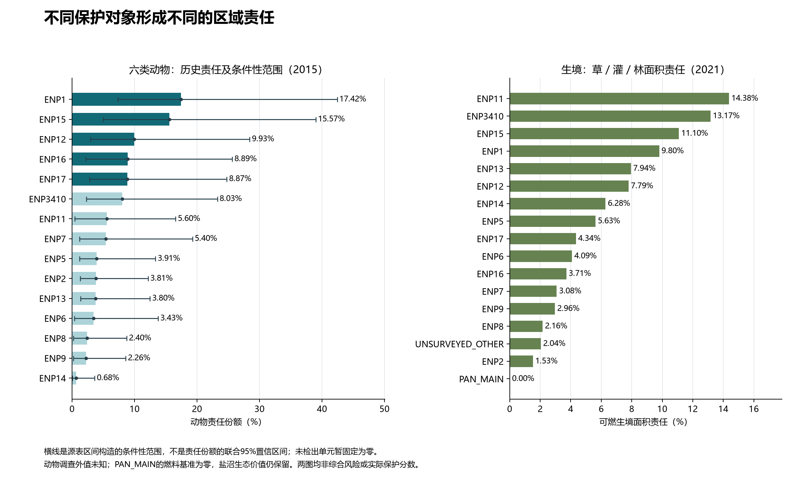
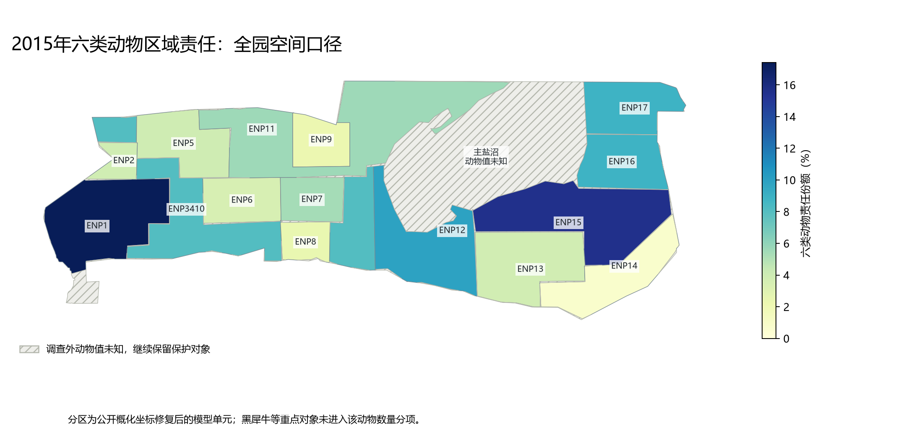

# 保护指标与验证技术备查

2026-10-05。以下保留前版的资源作用、时间阈值、基线和敏感性细节，供后续资源配置及验证使用。它们不属于当前第一问正文；具体响应期限、检查频次和达标数值仍为待检验的团队示例。

第一问以[精简正文](../paper/question1_protection_definition.md)为准。

## 1. 可执行的保护标准与对象差异

### 1.1 发现、核查与到场分别留证

`d`表示有效发现与核查能力指数，可用地面有效投入、无人机现场机时及适用卫星信息构造饱和函数：

\[
d_{jkt}=v_{jkt}\min\{1,\ a_k u^G_{jkt}+b_k u^D_{jkt}+s_{jkt}\}.
\]

其中`u`按固定作业范围或任务标准化，`v∈[0,1]`表示及时审核与有效观测的质量因子；系数由日志校准或明确的低/中/高情景提供。地面出行和无人机往返占用资源，但只按实际现场投入计算监测贡献。公开火卫星不提供发现偷猎者的贡献。AI并入审核工时和发现质量，不能默认告警无需人工核查。

`r`第一版取0/1：当班有可调度、技能合格且人数符合要求的队伍，并能在所选时限内到达才为1。到场时间含核查后调度、道路及道路外通行，不能只用区域中心，也不能复用无人机空中距离。发现等待、核查等待和到场时间分别报告；若要求起事至到场的总期限，必须把前两项计入。

`g=d×r`是能力指数，未假定它们是概率，故也没有声称乘积得到真实处置概率。发现与响应必须属于同一目标。设底层需求为`D_jkt`，区域汇总应满足：

\[
D_{ikt}=\sum_{j\in J_i}D_{jkt},\qquad
g_{ikt}=\frac{\sum_{j\in J_i}D_{jkt}d_{jkt}r_{jkt}}{D_{ikt}}.
\]

只有非零区域需求才定义该加权服务。一个地点只发现、另一地点只响应时，两点处置服务均为0；不能把两个平均值0.5相乘得到虚假的0.25。

### 1.2 规划阈值、重点底线与生态监测

下表提供第二、三问可检验的一版标准。**所有数值均为团队初始规划阈值，不是原题规定、主管部门标准或已证明可达的生态阈值。** 不同方案比较时固定，第四问再改变阈值。

| 对象/层次 | 初始量化标准 | 可测量的证据 |
|---|---|---|
| 全园声明范围 | 每个关键班次`P_t≥80`，同时报告逐威胁、逐对象分项 | 固定需求、人员/设备日志、班次分数、评价范围完整性 |
| 黑犀牛等关键动物目标 | 每个登记关键目标`g_j,poach,t≥0.90`；核查后合格队伍到场时限基准60 min，比较30/60/90 min | 目标或分布情景、核查/调度时间、技能和值守、通行及到场记录 |
| 已确认重要植物/生境，有害火季 | 关键目标`g_j,fire,t≥0.90`；核查后合格消防队伍到场时限基准30 min，比较30/60/90 min | 植物/生境依据、火情核查、消防资格、实际路线、是否计划烧除 |
| 关键可靠水源 | 常态每7日核查，偏干/故障情景每1日核查；到期关键检查完成率100%，严重异常24 h内启动核查/处置流程 | 坐标、天然/人工属性、状态年份、巡检记录、异常工单；启动流程不代表已修复或保证供水 |
| 主盐沼、季节性鸟类与生态功能 | 常态每30日完成登记观测，已确认敏感季节每7日；到期关键观测完成率100%，异常进入处置流程 | 有效观测与审核记录、敏感季节登记；观测不能代替鸟类数量/生态健康调查 |

公开卫星不保证全天连续观测，核查后到场时限也不等于从起事算起的总响应时长。实际总等待作为另一指标单列，不能用告警后响应快掩盖长时间无人发现。

盐沼与水源的检查要求记为`B_m,t∈{0,1}`，关键地点-威胁集合为`J_C`，定义班次规划达标：

\[
\mathcal C_t=\mathbf1\left\{P_t\ge80,\quad
\min_{(j,k)\in J_C}g_{jkt}\ge0.90,\quad
B_{m,t}=1\ \forall m\right\}.
\]

该二元判定仅在需求、重点目标、必要检查与所声明的范围完整已知时使用。未知时标记“资料不全”；已知违反条件时判定未达标。不存在模型需求时为“不适用”，不能自动获得100分。月报至少列`min_t P_t`、重点对象最低服务及未达标班次，不能只报月平均。

也可按对象分别报告：

\[
P_{s,t}=100\frac{\sum_{j,k}D_{jskt}g_{jkt}}{\sum_{j,k}D_{jskt}}.
\]

对象需求未知时不强行计算；关键地点仍须逐点达到最低服务，不能靠对象平均分补偿。`L_t`是未满足管理需求指数，`L_t/D_t=1−P_t/100`，不能解释为真实动物死亡率或损失额。

共享指标代码已实现“达标/未达标/资料不全”三种判定。纯公式示例：两目标需求9/1，第二目标为重点；服务0.894444…/0.95时为90分；改为0.922222…/0.70时仍为90分，却因重点服务不足而未达标；前一例若关键水源检查未知，则不能认证。重点服务与同一目标的总分输入一致；示例不来自公园实际部署。

## 2. 可用资料的完整区域责任计算

### 2.1 动物责任与集中程度

| 物种 | 2015调查估计合计 | 假设权重 | 平衡后物种权重份额 |
|---|---:|---:|---:|
| 蓝角马 | 4,207 | 2 | 14.29% |
| 平原斑马 | 14,232 | 3 | 21.43% |
| 长颈鹿 | 3,172 | 3 | 21.43% |
| 非洲草原象 | 2,911 | 3 | 21.43% |
| 南非剑羚 | 4,108 | 1 | 7.14% |
| 鸵鸟 | 3,695 | 2 | 14.29% |

基准`V_i^animal`和密度对照如下。密度栏以原调查面积为分母，保留份额单位，不再作为独立因子给总责任重复加分。

| 名次 | 调查区 | 动物责任 | 每1000 km²调查面积责任（份额） |
|---:|---|---:|---:|
| 1 | ENP1 | 17.42% | 0.1008 |
| 2 | ENP15 | 15.57% | 0.0764 |
| 3 | ENP12 | 9.93% | 0.0667 |
| 4 | ENP16 | 8.89% | 0.0968 |
| 5 | ENP17 | 8.87% | 0.0963 |
| 6 | ENP3410 | 8.03% | 0.0335 |
| 7 | ENP11 | 5.60% | 0.0199 |
| 8 | ENP7 | 5.40% | 0.0899 |
| 9 | ENP5 | 3.91% | 0.0389 |
| 10 | ENP2 | 3.81% | 0.1468 |
| 11 | ENP13 | 3.80% | 0.0266 |
| 12 | ENP6 | 3.43% | 0.0489 |
| 13 | ENP8 | 2.40% | 0.0542 |
| 14 | ENP9 | 2.26% | 0.0340 |
| 15 | ENP14 | 0.68% | 0.0060 |

前二区合计32.99%，前五区合计60.68%，表明选定历史动物责任分布不均。ENP2总责任第10而单位面积责任第1，说明总任务和投入强度需要分别看。责任份额不是全部动物个体占比，也不是预算分配比例。

选择先按物种份额平衡，表达“平衡各物种责任”的管理偏好；直接加权数量表达“更多保护个体”的另一偏好。两者均可作情景，没有一种由数量数据自动证明绝对正确。同一物种全部数量下降后再归一化，责任和仍为1，因此责任不能用于证明种群恢复。

调查外`PAN_MAIN`、`UNSURVEYED_OTHER`的动物值仍为未知。黑犀牛候选源表的分区合计1,107与总计1,280不符，且正文和表格矛盾，因此主数量矩阵不用其冲突值；后续重点目标/分布情景仍必须保留。南非剑羚ENP1等质量问题也未因加总一致或排序稳定而消失。

### 2.2 生境责任与动物责任分开

设2021林地、灌丛和草地基准面积为`A_i^F`，则`V_i^F=A_i^F/Σ_i A_i^F`。扣除主盐沼燃料基准后合计17,613.301 km²，约占所选园界76.89%。这是潜在可燃生境代理，不是珍稀植物数量、燃料载荷或有害火损失。

| 可燃生境面积责任名次 | 区域 | 份额 |
|---:|---|---:|
| 1 | ENP11 | 14.38% |
| 2 | ENP3410 | 13.17% |
| 3 | ENP15 | 11.10% |
| 4 | ENP1 | 9.80% |
| 5 | ENP13 | 7.94% |

该排序不同于动物责任，支持分别配置反偷猎与有害火需求。必须进一步结合真实火暴露或明确情景，才能比较火管理优先级。

`Moringa ovalifolia`在Fairytale Forest、Halali等地点的出现已有来源核查，可作为重点登记依据，不能由研究样本推全区株数。`PAN_MAIN`燃料基准为零是模型掩膜，不能推出盐沼鸟类和水文生态价值为零；原始植被面积仍保留供掩膜敏感性检验。

图1：柱/圆点表示动物基准责任；横线表示源表区间的条件性场景范围。右图是面积责任，均非综合风险或部署保护分数。

图2：调查外动物值用斜线标为未知。公开概化分区经过拓扑修复，不称官方管理分区或精确物种分布。

## 3. 调查不确定性、未检出与模型验证

四组类别权重情景中ENP1、ENP15均保持前二，最大名次变化为2；逐物种剔除最大变化为6。但权重敏感性只说明对管理权重的反应，不能代替抽样数量的不确定性。

补充采用逐区源表数量上下限`ℓ_is,u_is`构造矩形场景集。对某区，该物种最小/最大份额分别为：

\[
q_{is}^{\min}=\frac{\ell_{is}}{\ell_{is}+\sum_{h\ne i}u_{hs}},\qquad
q_{is}^{\max}=\frac{u_{is}}{u_{is}+\sum_{h\ne i}\ell_{hs}}.
\]

再按同一类别权重计算责任范围。源表空白、印出零密度且无区间的9个单元格暂固定为基准零。不同区域极值分别来自不同场景，不能一起相加；该范围不是联合95%置信区间，未假定调查误差独立或服从正态分布，也不能修复原表问题。

| 区域 | 基准责任 | 条件性最小值 | 条件性最大值 |
|---|---:|---:|---:|
| ENP1 | 17.42% | 7.31% | 42.43% |
| ENP15 | 15.57% | 4.95% | 39.01% |
| ENP12 | 9.93% | 2.93% | 28.43% |
| ENP16 | 8.89% | 2.21% | 25.63% |
| ENP17 | 8.87% | 2.80% | 24.77% |

明显重叠的条件性范围提示精确名次并未由现有调查牢固确定。每个区的上下界都已用具体数量情景重算验证，完整15区范围随JSON/CSV保存。

另作未检出压力测试：对有基准零区的物种，假设额外数量等于该物种调查总量的1%/5%，按原调查面积分给零区。没有零区的物种不添加；调查外不插值。

| 假设额外数量幅度 | 前五区 | 全部区域最大名次变化 |
|---|---|---:|
| 1% | ENP1、ENP15、ENP12、ENP17、ENP16 | 1 |
| 5% | ENP1、ENP15、ENP12、ENP17、ENP16 | 2 |

两个场景保留基准前五集合，但ENP16/17交换名次。1%/5%只是压力测试幅度，不是实测漏检率、总体置信区间或新增真实数量。

处理和指标验证已经通过：六类候选数量与源表合计一致，15调查区责任和为1；调查外未知未补零；同物种数量同比例变化不改变相对责任；条件性端点可由明确情景达到；未检出新增数量守恒。11项语义检查覆盖监测无响应、地点一致性、零/未知需求、同需求比较、高分掩盖重点失守、未知辅助要求及范围不完整等关键行为。验证证明处理和指标逻辑成立，不等于效能已经实证校准。

