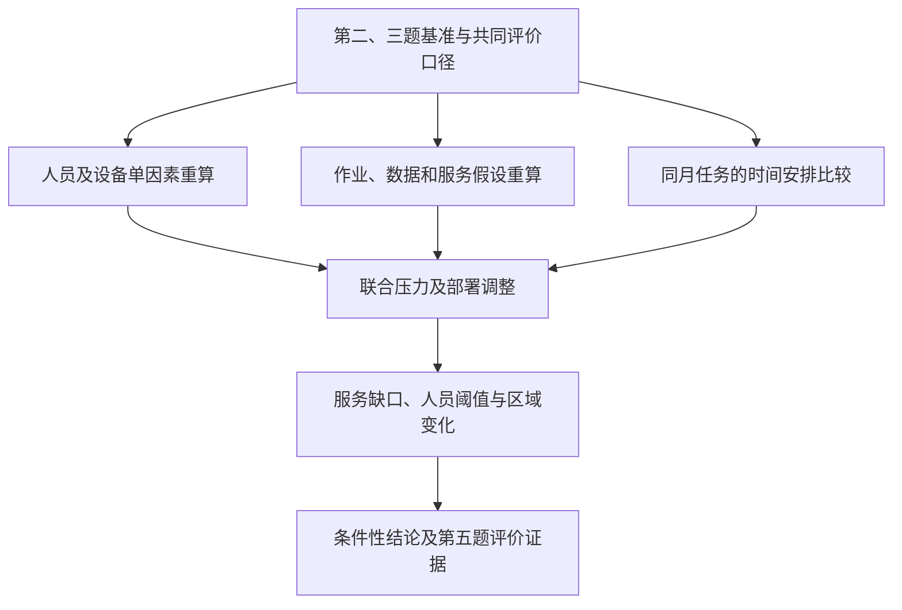

**历史备查：已被精简框架替代。** 原详细目录不再作为当前论文结构，内容仅用于查阅分析方法。现行框架见[精简版](../paper/question4_framework.md)。

**第四部分：保护策略的敏感性与情景分析**

版本：2026-10-06。参照[第二题框架](../paper/question2_framework.md)的组织方式，构建第四题的一、二、三级标题和逐节写作逻辑，并衔接[第三题框架](../paper/question3_framework.md)。本文件是正式写作框架；引用已有实算时注明来源，新增梯度、联合情景、共同口径评价和巡护时间比较均标为待计算。本轮不修改模型代码、原始资料和第二、三题结果，不展开其他题目的目录。

**本部分回答的问题。**人员、设备、作业条件、服务要求或巡护安排改变后，原保护策略还能提供什么服务；维持既定目标需要多少人；应当怎样调整部署；结论在哪些条件下成立。沿用原模型求解，不另建一套保护评分模型，也不因情景无解而放松硬性任务。

**完整逻辑链，按六步写作。**

1. **确定比较基准与变化因素。**先说哪些量保持不变、哪些量变化，区分第二题监测基准与第三题含季节任务的基准，保证比较公平。
2. **单独改变人员和技术资源。**重新求解服务分、人工用途和机时，寻找服务开始下降及模型不可行的资源边界。
3. **检验关键假设和输入。**改变通行条件、技术适用性、权重、空间尺度及季节服务要求，判断建议是否依赖某一假设。
4. **检验任务在时间上的分布。**保持月度资源和任务总量，比较均匀与集中安排，识别月度汇总掩盖的分时容量和访问间隔问题。
5. **组合压力并比较部署调整。**研究人员与设备同时减少、重点季节叠加设备不足，比较保留原空间规则与允许重新配置的结果。
6. **形成有条件的管理结论。**报告主要瓶颈、可维持目标的条件和调整方向，再把证据交给第五题讨论模型优势与局限。

# 4 保护策略的敏感性与情景分析

## 4.1 分析目标、比较基准与情景设计

### 4.1.1 第二、三题基准方案与分析任务

先承接前两部分结果，不重复推导整个LP。第二题基准为17个父区、599个检查单元、六处候选响应驻点，人员预算7080人时、机时预算240；规定日间响应及基准监测，不含水点和降雨。第三题中档基准加入可响应范围内的额外火险检查及17处历史钻井水点样本运维。

明确两条评价支路：

- **固定资源，求最高服务。**预算变化后重新最大化服务分，回答参考人员能提供多少规定服务。
- **固定目标，求最小人工。**保持 \(\eta=P_2^*\approx57.26016128\)，重新最小化人时，回答维持同一目标需要多少人员。

第三题新增任务属于必须完成的工作，在固定资源求解中可能挤压基准监测，严重时导致无解。无解要说明原因，不用人为低分代替。两条支路分别继承第二、三题模型，不能用Q2不含水点的资源阈值直接评价Q3峰值月。

**本节输出：**基准参数、基准时期和待检验问题。第二题用于隔离资源替代机制，第三题用于检验季节任务下的人员建议。

### 4.1.2 变化因素、参数范围与证据分类

把情景分为单因素变化、少量联合压力和时间安排变化。先列参数表，再说明范围来源：资料支持的范围、沿用的团队假设、人为压力测试设计分别标注。

|因素|基准或已有范围|在模型中改变什么|本部分用途|
|---|---|---|---|
|人员资源|59个参考保护岗位；7080人时|人员预算 \(H=120N\)|服务下降阈值与人员缺口|
|无人机资源|6架；240机时/月|机时上限 \(U\)|地面替代、操作人工和资源瓶颈|
|通行和作业条件|道路速度30；已有20/40 km/h对照|\(r_j,a_j,b_j,\gamma_j\)中实际受影响项|响应范围与工作成本|
|赋权和空间近似|熵权；CRITIC；5/10/15 km格网|权重、代表点及对应成本|需求和部署对输入的依赖|
|季节服务要求|低、中、高档频次及耗时|\(D_{jt},W_t\)|服务要求与人员需求的关系|
|水点清单缺失|17处历史样本；工作量1/2/3倍|仅增加必要水点人时|清单不足的工作量压力|
|巡护时间分布|月度汇总未指定实际日期|子时段任务和可用资源|服务连续性及分时可行性|

**始终固定单人有效工时120小时/(人·月)。**不新增节假日、休假或高温折减。资源削减比例不是发生概率，低中高档不是置信区间；水点倍增不是新增实测点位。季节窗口和样本来源引用第三题，不在此重复搜集整理全部资料。

**本节输出：**“参数—来源—变化范围—控制变量—求解模式”的情景登记表。

### 4.1.3 比较指标与共同评价口径

沿用服务分而非重新定义生态成效。对情景 \(m\) 保存服务向量和投入，报告：总服务分、动物/生境分项完成、17区服务与响应缺口、人工用途、机时、预算余量、硬约束状态；第三题情景另报告目标下最小人时及全年峰值人数。

在单元和基准检查协议相同时，用固定基准权重评价：

\[
P_m^{\mathrm{ref}}=100\sum_jw_j^{\mathrm{ref}}s_j^{(m)},\qquad
\Delta P_m=P_m^{\mathrm{ref}}-P_0^{\mathrm{ref}}.
\]

动物与生境分项分别按其基准分项权重汇总。区域通用完成率和可响应范围同时报告，不能把“可响应部分全部完成”误写成“整个父区全部完成”。

改变赋权方法时，保留新权重用于配置，但另按基准权重评价各解；改变检查频次时，完成率的分母已经改变，应另以实际提供的**基准监测合格点次**对照原检查协议，避免放松标准后高分被解释为保护改善。额外火险点次不自动重复计入基准点次。格网变化时先汇总到共同父区或共同空间范围，不直接逐点相减。

改变响应期限属于服务标准变化，2小时与3小时的分数不能直接解释为同标准下的提升。单独报告可达范围、成本及标准变化。

**本节输出：**统一比较规则与指标表。未完成的共同口径重评应标为待计算。

## 4.2 人员与技术资源敏感性

### 4.2.1 人员预算减少与服务缺口

先固定权重、路网、服务要求、机队及响应方案，只改变总人时预算。第一轮可测试基准的100%、90%、80%、70%、60%、50%、40%，在转折附近加密；比例梯度用于连续预算诊断，人员建议最终按整数岗位及120小时换算。

每次重新求最高服务，绘制 \(P^*(H)\)，并报告区域缺口及人工用途。共享响应 \(H_0=2880\) 不随监测预算同比缩小；保持六驻点方案时，\(H<H_0\) 必无解，\(H\ge H_0\) 仍可能不足以完成区域底线和新增任务。

已有Q2结果：人时减少20%仍为57.26分，减少40%降至45.77分。这只能支持两处已测试条件；**服务开始下降的精确位置仍需梯度或逆向求解确定。**第三题还需对常规月份、峰值月份分别重算，不能把Q2的余量当作全年可减员空间。

**本节输出：**人时—服务曲线、首次失去目标的区间、不可行区间和主要受影响区域。

### 4.2.2 无人机减少与地面人工替代

固定其他参数，按现行每架每月40机时假设，将6至0架对应为 \(U=240,200,160,120,80,40,0\)。这是设备可用量变化，不改变单架观察协议和所需操作人员。

分别画服务分和人时用途的变化：无人机机时减少后，地面检查是否增加、配套操作人工是否减少、总人工怎样改变。无人机筛查人工始终计入预算；响应和水点运维不能被机时替代。

已有Q2结果：机时减半仍为57.26分，但代表解总人工升至5319.01人时；无人机停用仍能达到同分，使用6244.08人时。它说明基准人工预算可以补偿设备减少，不能说明技术不重要。Q3中档峰值在设备停用下已有67人的核验结果，可用于说明新增任务之后的替代代价，但不能直接和Q2的人工数混用。

**本节输出：**设备—服务曲线、地面/无人机配套人工变化和目标下所需人员。

### 4.2.3 维持目标的资源阈值与失效原因

衔接第三题的逆向求解，定义固定目标下的资源需求：

\[
H_t^{\mathrm{crit}}(U;\eta)=
\min\{H_t(\mathbf z_t):\mathbf z_t\in\mathcal F_t(U),\ P_t\ge\eta\},
\qquad
N_{\mathrm{year}}^{\mathrm{crit}}(U;\eta)=
\max_t\left\lceil H_t^{\mathrm{crit}}(U;\eta)/120\right\rceil.
\]

\(\mathcal F_t(U)\)含服务容量、机时、区域底线和必要任务，不含固定人员总预算。Q2资源阈值计算关闭Q3新增任务，但允许同分服务向量重新选择。

区分三类限制：人工不足、技术不足，以及目标超过地理可达上限。前两者可能通过资源替代或增员改善，地理不可达要改变驻点或通行方案；增加人员不能自动提高 \(P_{\mathrm{geo}}\)。

已有无新增工作且允许同分重配时的最省人工为5286.1143人时；Q2的5288.3749是固定最优服务向量的代表成本，两者不可混写。不要直接把无人机实际使用144.57机时称为最低必需机时，地面可以替代。

**本节输出：**目标所需人时/人数随设备变化的曲线及明确的失效原因。

## 4.3 关键假设与输入数据敏感性

### 4.3.1 通行成本、响应范围与技术适用性

先整理已有道路速度20/30/40 km/h及作业人工增加25%的结果。道路速度改变时重算响应可达性和往返成本，固定基准评价权重；额外工作量也要按新的路线成本更新，不能只改总分。

已有Q2道路情景为35.76/57.26/64.69分。慢速情景人工减少可能只是可服务范围缩小，不是效率提高，因此必须同时看地理上限和未响应需求。

技术检验优先选一种明确变化，如缩小可用无人机单元集合，或提高地面核查工作要求。变更 \(a_j\) 与无人机单次配套人时 \(o_j\) 后再计算 \(\gamma_j=o_j/b_j\)，避免对操作人工重复乘成本系数。只有飞行时间确实改变时才更新 \(b_j\)。涉及路段关闭和技术参数时，范围依据需在正式实算前补齐；不能把设备官方极限性能当园区实测能力。

**本节输出：**同标准下的可达范围、投入结构和服务变化，说明限制来自响应还是作业成本。

### 4.3.2 需求权重、历史数据与空间尺度

将权重方法、历史动物输入和代表点近似分开说明。权重对照采用熵权、CRITIC及少量管理偏好情景；动物输入可接入第一题已做的数量区间或物种剔除，但必须重新传递到需求和配置，不能仅引用第一题排名稳定便宣称部署稳定。

在基准与紧缺预算下各比较一次，按共同权重报告对象分项和区域部署。基准已达上限时，权重变化可能只改变评分表达；紧缺预算更能检验配置优先级是否改变。AHP和熵权各自承担不同层次的赋权，不能混称完全客观权重。

已有5/10/15 km格网结果为56.39/57.26/59.99分。解释为代表点及离散化敏感性；面积需求继续按真实面积计算，不随格网数量直接增加。三个尺度不能证明空间收敛，也不能生成原数据未提供的小单元动物观测。

**本节输出：**共同尺度评分、分项服务、区域投入变化与空间近似影响。

### 4.3.3 季节服务强度与水点样本工作量

首先单独改变火险额外频次、水点访问频次和现场作业时长，以识别影响来源；随后使用第三题已保存的低中高服务组合，展示管理标准整体改变时的人员范围。低中高组合同时变动多个参数，不能作为某一个参数的纯敏感性。

|第三题已保存组合|正常季节全年峰值人数|异常干旱运维压力下|
|---|---:|---:|
|低档|51|53|
|中档|57|62|
|高档|72|78|

这些结果在相同基准目标下比较必要任务的工作量，并非人员估计的置信区间。异常干旱是旱季水点运维加密情景，不是气象预测，不引入SPI或无依据运水体积。

水点工作量按样本平均成本复制1/2/3倍时，中档峰值已有57/61/64人结果。它检验台账不足可能带来的人工压力，不代表真实34/51处钻井，也不能代表新点位的空间成本。新点位若位置不同，必须重算路线。

**本节输出：**单因素工时变化、组合服务标准下的人员表和清单缺失压力的结论边界。

## 4.4 巡护时间安排的情景比较

### 4.4.1 相同月度任务下的均匀与集中安排

明确原月度LP的不足：同样的月总点次和人机资源，可能对应完全不同的执行日期。改变总检查次数只能检验服务强度，不能代替巡护时间安排分析。

在既有日间窗口内，为一个常规月和一个重点火险旱季月预设两种代表安排：任务分散执行，或集中在少数日期/时段执行。保持月总人员预算、可用机时、必要任务数和点位范围相同，只改变时间分布。均匀安排允许不同水点错开访问，不假设17点必须同日访问。

水点有实体点位和整数访问次数，适合明确列出预定日期并比较实际间隔；599个检查单元的面积比例点次仍是连续工作量近似，不能直接按 \(30/C_j\)宣称每个单元的真实巡检间隔。时间安排是待计算的代表情景，不补建复杂轮班模型。

**本节输出：**代表月的时间窗口、设备可用日期及两种任务安排表。

### 4.4.2 分时容量、无人机可用日与水点访问间隔

将月度分为少量子时段 \(d\)，明确各时段实际可用的人时 \(H_{td}^{\mathrm{avail}}\)、机时 \(U_{td}^{\mathrm{avail}}\)与响应预留。它们分别汇总到原月度预算，不能凭空增加资源。

继承六机、每机每天2小时、每月20个可飞行日的上限，依据预设可用日分配机时，不能简单平均到30天后声称仍保留原作业安排。人员分时容量若采用均匀可用假设，应明确它是额外的时间分布假设，月有效工时仍为120，不另扣假日。

对预设安排逐时段检查：

\[
H_{0,td}+W_{td}+H_{td}^{\mathrm{monitor}}+H_{td}^{\mathrm{fire}}
\le H_{td}^{\mathrm{avail}},\qquad
U_{td}^{\mathrm{monitor}}+U_{td}^{\mathrm{fire}}
\le U_{td}^{\mathrm{avail}}.
\]

基准与火险人工均含无人机操作，水点人工含往返及现场；响应按窗口长度单独计入。分时容量只能提供必要的执行检查，不验证逐人资格、驻点并发或详细路线。

对于水点 \(\ell\) 的实际预定访问时刻 \(\tau_{\ell k}\)，计算最长相邻访问间隔；重复月模式时纳入月末到下月首次访问的间隔，季节转换时单独检查边界。将它与第三题15/7.5/3.75天的规划目标对照，明确连续时间安排与实际日期取整的差别。第三题的 \(30/f_t\) 是均匀安排下的目标间隔，不能当任何执行日期的已达间隔。

**本节输出：**超出分时容量的窗口、水点最长访问间隔及时间缺口。

### 4.4.3 服务连续性缺口与时间调整建议

报告哪些安排月总工时合格、分时容量却不合格，哪些水点访问总数达标、最长间隔却超标。若计算显示集中安排有缺口，说明能否通过错开水点出行、分散飞行日或调整任务时间改善；不预先断言必然发生缺口。

所有建议在同一总预算和日间能力下比较。时间分布改善不自动提高原月度评分，也不代表夜间保护或实际生态损失减少。若需分时重算，沿用原服务容量约束增加时段索引，不引入新的生态评分。

**本节输出：**时间安排比较图及在已测试窗口内的调整建议。未实算前正文只保留方法，不写结果结论。

## 4.5 联合压力与部署调整

### 4.5.1 人员与无人机资源的联合变化

在固定空间和服务规则下建立 \(H\times U\)情景矩阵，绘制最高服务和不可行范围。先用Q2解释资源替代，再选Q3峰值月重复关键组合；两套基准分别作图或清晰分面。

已有Q2人时减少40%时45.77分，叠加无人机停用降至37.93分，说明单项设备停用仍达标不代表联合压力仍能达标。完整二维阈值仍需重算，不能用这一对结果填满矩阵。

**本节输出：**资源组合热力图、目标可维持区和不可行边界，解释何时人工可以补偿技术减少。

### 4.5.2 季节高工作量叠加技术或通行不足

只选少量有管理含义的联合压力，例如：重点火险旱季加设备减少；异常干旱水点运维加设备减少；峰值任务加较低道路作业速度。明确每项改变怎样进入需求、成本、适用集合或可达性，不直接把压力比例乘总人数。

维持同一目标先检查地理上限，再反求人时；若新通行条件使 \(\eta>P_{\mathrm{geo}}\)，报告目标在现有响应方案下不可达，不能输出一个靠增加人数实现的方案。新增任务在不可响应范围外的缺口继续单列。

不进行全部参数组合穷举，没有分布依据时不附发生概率、风险概率或统计置信区间。

**本节输出：**联合情景下的服务缺口、所需人员和无法通过增员消除的地理缺口。

### 4.5.3 保留原空间规则与重新优化的比较

区分“原策略能承受变化”与“变化后能找到新的好策略”。不能只给重新优化的最好结果，就宣称原部署稳健。

在同一新情景下设置两个可比方案：保留基准监测服务的空间比例，但允许地面/无人机方式调整；完全允许空间和技术重新配置。前者可用 \(s_j=\lambda s_j^0\)、\(0\le\lambda\le1\)作为一种明确的受限规则，仍保留区域底线和必要任务，不是直接同比缩放全部人员。须说明该规则是比较工具，不是公园现行制度。

若原比例遇到不可达单元、资源不足或底线冲突，报告原规则不可行。两者均可行且采用同一目标时，报告重新配置增加的服务分及区域变化；目标下逆向比较则报告节省人时。重新优化包含更多可选方案，改善本身是模型内比较，不能解释为实测保护收益。

**本节输出：**原空间规则/调整后方案对照、改善幅度和资源移向哪些区域。该受限对照尚待实现和计算。

## 4.6 分析结果、策略稳定性与条件性结论

### 4.6.1 资源阈值、主要影响因素与结论变化

根据实际完成的情景回答：人员减少到什么条件开始失去目标；设备减少是否仍能靠人工补偿；哪些假设改变会改变人员建议或部署重点。比较分数和连续人时，再解释人数向上取整造成的阶梯变化。

基准已达地理上限时，小范围变化可能使分数不变但人工上升；不能据此称参数不重要。道路响应门槛和资源切换可能出现突变，不以一个局部弹性概括全部范围。只有范围、单位和情景强度可比时才比较因素影响大小，不建立无依据的全局敏感性排名。

**本节输出：**参数影响摘要及明确到条件、方向和幅度的结论，不提前写“模型总体稳健”。

### 4.6.2 区域部署变化、瓶颈识别与结果核验

选择少数关键情景解释17区的服务缺口和投入转移，将总分变化对应到具体区域及响应范围。区权重、作业成本和底线共同影响分配，不能仅根据总权重判断投入应同比变化。

复核约束残差、人工用途、机时、必要任务、区域底线和汇总一致性。在其他条件固定时，放宽 \(H\)或 \(U\)不应降低最高服务，增加 \(U\)不应提高目标下最小人工；用这些关系查找计算或汇总错误。条件同时改变时不套用上述单调结论。

存在多个同分解时，投入地图改变可能来自解的选择；同时检查评分、约束和人工差别，避免把近似同分的地图变化解释为战略崩溃。

**本节输出：**关键区域对照图、瓶颈解释和数值核验摘要。

### 4.6.3 管理建议、证据边界与第五题衔接

每条结论按“改变的条件—已计算结果—对应调整—适用范围”写。例如设备不足可在人工余量内补偿，峰值季节需按工作量保留人员余量，地理缺口需调整响应条件；具体数值只引用已经求解核验的情景。

结尾限定为已测试参数和服务协议下的策略稳定性，不声称真实事故损失降低、所有扰动下稳健或具有确定发生概率。把计算证据及暴露出的限制交给[第五题框架](../paper/question5_framework.md)：资源替代支持人机协同优势，地理门槛支持显式响应约束，频次/台账压力揭示校准需求，分时不足揭示月度近似的边界。

**本节输出：**条件性策略建议及第五题的证据清单。

---

**写作顺序。**每类分析都按“检验问题—控制变量—变化范围及依据—重算方式—图表结果—部署解释—结论边界”展开。正文先解释变化为何影响可行域或工作量，再展示结果。不要只堆情景表，也不要重复第二、三题完整公式推导。

**正文图表。**优先保留人员/机时资源曲线、人员×机时热力图、季节标准与人员表，以及代表时间安排对照。区域投入变化可作热力图附图或正文短表。全部参数组合、解向量和核验明细放复算附件。按完整解答20页限制，正文宜控制在约3—4页，视最终图表调整；三级标题指导组织，短节可用紧凑段落表达。

**已有证据。**[Q2保存结果](../../output/question2/q2_results.json)、[Q2核验](../../output/question2/q2_verification.json)、[Q3保存结果](../../output/question3/q3_results.json)、[Q3假设](../../data/modeling/q3_assumptions.json)、[Q3敏感性表](../../output/question3/q3_sensitivity.csv)、[Q3独立核验](../../output/question3/q3_independent_verification.json)。原题见[题目文本](../../tmp/pdfs/problem_review_extracted.txt)，早期设计保留在[初步方案](../第四五题初步方案.md)。

**待完成计算。**完整资源梯度和阈值曲线、二维资源矩阵、权重共同口径重评、季节参数单独变化、时间安排对照、受限空间规则与重新配置比较。现有情景能支撑部分分析，不能代替这些尚未完成的结果。本轮仅完成框架和逻辑链，未新运行模型、提交或推送。
