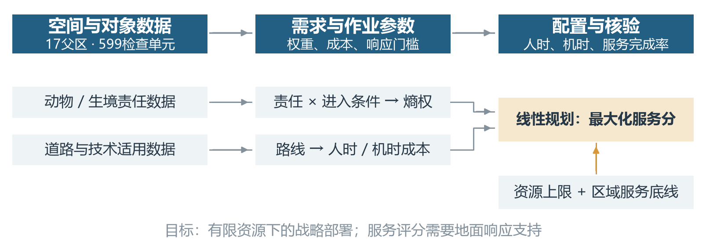
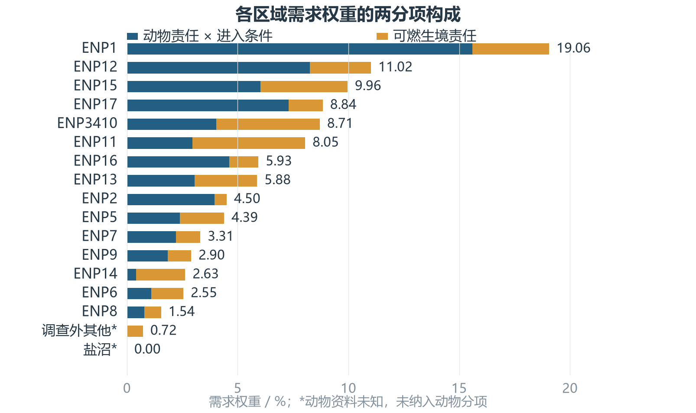
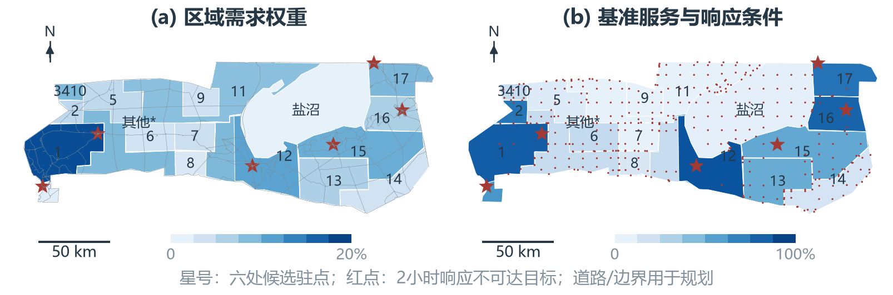
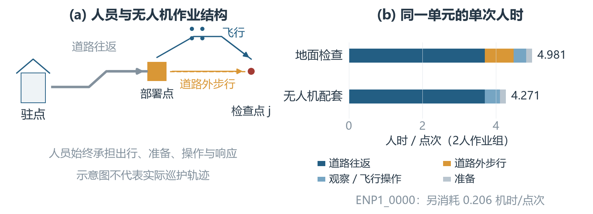
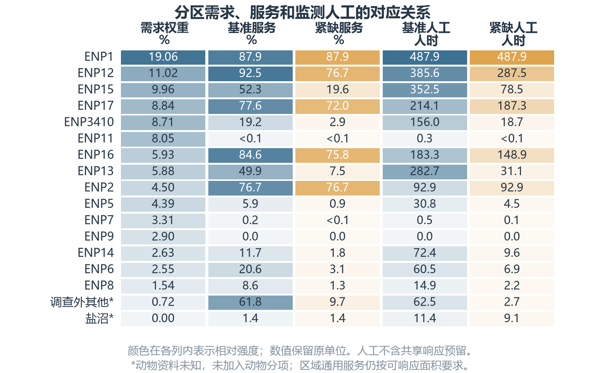
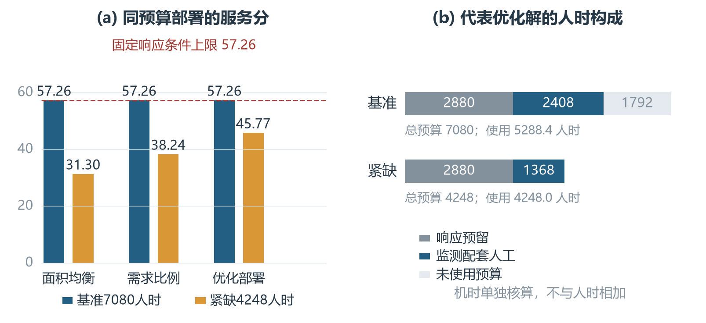

# 第二题正式正文

# 2 有限资源下的人机协同保护资源配置模型

第一题确定了保护对象及其区域责任，第二题进一步回答：在人员与无人机资源有限的条件下，如何配置监测投入，才能完成更多重要区域的规定服务？为此，先把动物与生境资料转化为需求权重，再由有向道路网络计算每次作业成本和响应范围，最后建立地面人时与无人机机时共同约束的线性规划。图2-1展示从数据到部署方案的计算关系。

图2-1：数据、需求、作业成本与资源配置的计算流程

## 2.1 配置目标、研究单元与基本假设

### 2.1.1 区域、检查单元与规划时期

承接第一题的空间划分，将15个动物调查区、主盐沼及其他调查外区域作为17个父区，记为集合\(\mathcal I\)。为计算区域内部的道路差异，以10 km格网与父区相交后的每个连通片作为检查单元，得到集合\(\mathcal J\)，共599个单元；属于父区\(i\)的单元组成\(\mathcal J_i\)。每片取一个内部代表点用于计算接近路线，片面积\(A_j\)用于分配规定检查量。该点是战略规划的空间代理，其完成一次检查不表示整个连通片已被连续覆盖。

采用月度规划期，并仅分析规定日间窗口。全部作业支持面积在本模型的UTM投影下为22897.10 \(\mathrm{km}^2\)；需求、服务和分区汇总均使用同一面积口径。动物、土地覆盖、道路资料分别来自2015年、2021年和2026年快照[survey，worldcover，osm]，用于构成固定规划基线。

### 2.1.2 地面人员与无人机的服务职责

一次合格检查采用统一记录清单，对选定动物异常和可燃生境异常进行筛查。假设地面与无人机在技术适用区域内均能完成该清单，因此可以按完成点次相加；无人机不能完成的隐蔽目标筛查不作等价折算。人员还承担设备运输、准备、飞行操作及现场响应，故机时投入必须同时占用配套人时。

设置Okaukuejo、Halali、Namutoni、Olifantsrus、Galton Gate及Nehale Gate六处候选驻点，记为\(\mathcal B\)。其位置来自已有地点资料，但驻点用途是本研究的规划假设。每个驻点预留日间响应人力，并假设事件较稀疏，使共享响应队伍可在该窗口内承担临时核查；本题不建立事件并发或详细轮班模型。

### 2.1.3 资源统计口径与规划假设

人员资源以人时计：两人共同工作一小时消耗两个人时；无人机资源以单架累计飞行小时计。原题给出的295人为部门工作人员参考数，不能直接视为保护岗位人数。保护岗位参与比例、有效工时及设备规模等采用表2-1的显式规划假设。通过保留较少、含义明确的参数，把数据缺口集中在服务标准与作业条件上，而不假定未经观测的真实减损率。

表2-1：主要参数、单位与规划口径

| 参数组 | 数值 | 用途 |
| --- | --- | --- |
| 空间尺度 | 10 km；17父区、599单元 | 计算及区域报告 |
| 移动速度 | 道路30、步行4、飞行40 \(\mathrm{km/h}\) | 路径与成本 |
| 观察、准备、调度 | 10、5、10 min | 单次作业与响应 |
| 响应期限及窗口 | 2 h；8 h/日，30日/月 | 可达性与预留 |
| 作业队伍 | 地面2人、无人机2人 | 人时换算 |
| 飞行安全与开阔程度 | 单次0.6 h；父区开阔比例至少0.6 | 无人机适用性 |
| 服务频次 | 每100 \(\mathrm{km}^2\)每月8点次 | 规定需求 |
| 进入衰减与区域底线 | \(\tau_E=2\) h；\(\beta=0.15\) | 需求及最低服务 |
| 人员预算 | 295人参考；20%参与；120 h/人/月 | 7080人时/月 |
| 响应驻点 | 6处；各2人 | 2880人时/月 |
| 设备预算 | 6架；2 h/架/日；20日/月 | 240机时/月 |

注：295人为原题参考数；空间离散、参与比例、作业时间、队伍、服务标准及新增设备规模均为团队规划设定，不作为公园现行制度。

## 2.2 区域保护需求与配置权重

### 2.2.1 动物保护责任与可燃生境责任

动物数量差异较大，直接相加会使数量多的物种支配指标。因此先在同一物种内部求区域份额，再按保护类别加权。设\(\mathcal M\)为已采用的六类调查对象，\(N_{im}\)为区域\(i\)内对象\(m\)的历史数量，\(q_{\ell(m)}\)为其保护类别权重，定义
\[
V_i^A=
\frac{\displaystyle\sum_{m\in\mathcal M}q_{\ell(m)}
\frac{N_{im}}{\sum_{k\in\mathcal I_S}N_{km}}}
{\displaystyle\sum_{m\in\mathcal M}q_{\ell(m)}},
\qquad i\in\mathcal I_S.

\tag{2-1}
\]
其中\(\mathcal I_S\)为15个有动物调查数据的父区。六类对象为蓝角马、平原斑马、长颈鹿、非洲草原象、南非剑羚及鸵鸟；数量与密度提供同源信息，因此不再重复加入密度项。式（2-1）满足\(\sum_{i\in\mathcal I_S}V_i^A=1\)，表示区域承担的已测对象保护责任。

依据法规类别[law]，按可猎、保护、特别保护的顺序建立AHP判断矩阵
\[
\mathbf A=
\begin{pmatrix}
1&1/2&1/3\\
2&1&1/2\\
3&2&1
\end{pmatrix},\qquad
\mathbf q=(0.163424,0.296961,0.539615)^{\mathsf T}.

\tag{2-2}
\]
取最大特征值对应的正特征向量并归一化，得到\(\mathbf q\)。一致性比率为
\[
CR=\frac{(\lambda_{\max}-3)/2}{0.58}=0.007933<0.1.

\tag{2-3}
\]
矩阵中的比较数值由团队设定；法规提供类别依据，并未规定这些数值。主盐沼和其他调查外区域的动物责任保持未知，不对其外推数量，也不以零替代真实动物价值。

生境分项采用第一题经过盐沼掩膜后的林地、灌丛和草地面积\(A_i^F\)，定义
\[
V_i^F=\frac{A_i^F}{\sum_{k\in\mathcal I}A_k^F}.

\tag{2-4}
\]
该指标给出可燃生境的区域责任。由于目前仅核验了单月过火样例，尚不足以估计多年有害火暴露，本模型对可燃生境采用等暴露假设。因而\(V_i^F\)既不是火灾概率，也不是火灾损失率；主盐沼燃料基准为零，也不能推断其生态价值为零。

### 2.2.2 道路进入便利度与监测需求修正

动物责任较高且较易从外部进入的单元，应获得较高反偷猎筛查优先级。为把这一判断量化，将道路与公园边界的27个交点作为进入候选源，在有向路网上采用多源Dijkstra算法计算到单元最近道路接入点的最短路距离\(D_j^E\)，并加上道路外接近时间：
\[
T_j^E=\frac{D_j^E}{v_g}+\frac{d_j^{\perp}}{v_w},
\qquad
E_j=\exp\!\left(-\frac{T_j^E}{\tau_E}\right).

\tag{2-5}
\]
其中\(v_g,v_w\)分别为道路和步行速度，\(d_j^{\perp}\)为代表点到最近候选道路的距离。指数形式使进入时间增加时权重平滑下降，且\(0\le E_j\le1\)。取\(\tau_E=2\) h；该尺度是规划假设。无有限进入路径时令\(E_j=0\)。道路边界交点并非已证实的偷猎入口，因此\(E_j\)只作为进入便利度代理。

父区资料需要下分到检查单元。缺少更细动物分布时，假设同一父区内动物责任按面积均匀分布；生境责任亦按父区面积份额分摊，不宣称已获得逐格网实际燃料量。于是
\[
\mu_j=\frac{A_j}{A_i},\quad
\sum_{j\in\mathcal J_i}\mu_j=1,\qquad
R_j^A=V_i^A\mu_jE_j,\quad
R_j^F=V_i^F\mu_j.

\tag{2-6}
\]
动物分项同时包含责任与进入条件；生境分项包含可燃面积责任。二者均为非负规划需求，进入条件只修正动物分项。

### 2.2.3 基于共同数据范围的熵权计算

两分项的组合权重采用熵权法确定。先将单元需求汇总到父区：\(X_{ik}=\sum_{j\in\mathcal J_i}R_j^k\)，\(k\in\{A,F\}\)。在15个共同有数据的父区上组成\(15\times2\)矩阵，而不直接对599个单元赋权，避免不同区域的切片数量影响信息差异。

两列均为非负责任量，故按列合计作比例归一化：
\[
p_{ik}=\frac{X_{ik}}{\sum_{v\in\mathcal I_S}X_{vk}},
\qquad
\sum_{i\in\mathcal I_S}p_{ik}=1.

\tag{2-7}
\]
不进行极差拉伸，以免把最小正责任人为变成零。接着计算信息熵和差异度：
\[
e_k=-\frac{1}{\ln15}\sum_{i\in\mathcal I_S}p_{ik}\ln p_{ik},
\qquad d_k=1-e_k,

\tag{2-8}
\]
并约定\(0\ln0=0\)。当一列在所有区域的比例相等时，\(e_k=1\)，其区分能力为零；越集中于部分区域，熵越低，差异度越大。最终取
\[
\alpha_k=\frac{d_k}{d_A+d_F},\qquad
\alpha_A+\alpha_F=1.

\tag{2-9}
\]
列总量为零或两列差异度总和为零时，该赋权不可识别，应返回数据不足，不能继续除法。主盐沼及其他调查外区域的动物资料未知，因此不参加权重估计。实际计算如表2-2所示，得到\(\alpha_A=0.645551\)、\(\alpha_F=0.354449\)，由所选数据的区域差异确定组合比例。

表2-2：共同15区数据的熵权计算

| 需求分项 | 信息熵 \(e_k\) | 差异度 \(d_k\) | 组合权重 \(\alpha_k\) |
| --- | --- | --- | --- |
| 动物责任与进入条件 | 0.881596 | 0.118404 | 0.645551 |
| 可燃生境责任 | 0.934989 | 0.065011 | 0.354449 |

注：按父区汇总、按列比例归一化；未知动物区不填零、不参加熵权估计。

熵权说明所选数据在区域之间的差异程度，不表示动物损失与火灾损失的真实占比。动物类别判断及等火暴露假设仍保留各自的判断成分，因此这里的“数据赋权”不能解释成全部参数已客观观测。

### 2.2.4 检查单元权重与区域汇总

熵权是在共同范围上估计的组合系数；实际部署中，各分项仍按自身有评价数据的范围归一化。动物分项只统计\(\mathcal J_S=\bigcup_{i\in\mathcal I_S}\mathcal J_i\)，生境分项覆盖全体单元：
\[
w_j^A=\begin{cases}
R_j^A/\displaystyle\sum_{\ell\in\mathcal J_S}R_\ell^A,&j\in\mathcal J_S,\\
0,&j\notin\mathcal J_S,
\end{cases}
\qquad
w_j^F=\frac{R_j^F}{\sum_{\ell\in\mathcal J}R_\ell^F}.

\tag{2-10}
\]
调查外的零系数仅表示未纳入已测动物分项，其原始动物值仍为未知。将两个归一化分项组合为
\[
w_j=\alpha_Aw_j^A+\alpha_Fw_j^F,
\qquad W_i=\sum_{j\in\mathcal J_i}w_j.

\tag{2-11}
\]
因为两分项各自合计为1，故\(\sum_jw_j=\alpha_A+\alpha_F=1\)，\(W_i\)可以解释为父区在当前目标内的需求份额。图2-2展示其分项构成：ENP1、ENP12和ENP15需求权重分别为19.06%、11.02%和9.96%。权重给出服务的重要程度；实际分配还取决于完成服务所需的时间和响应可达性，不能直接将\(W_i\)当作人员分配比例。

图2-2：父区需求权重的动物与可燃生境分项构成。颜色为组合权重加权后的份额，合计100%；未知动物区以*标记。

## 2.3 地理可达性与单位作业成本

### 2.3.1 有向路网、最短路径与响应门槛

将道路构成有向图\(G=(\mathcal V,\mathcal E)\)，保留原道路节点连接和单行方向。本模型包含1447个节点、3611条有向弧。代表点投影到最近候选道路，接入距离按路段长度分摊至两端，再分别求去程与返程最短路径，不用直线补齐不连通道路。假设管理车辆可使用候选道路，并以道路外直线步行近似最后接近过程。

记驻点\(b\)至单元道路接入点的去返距离为\(d_{bj}^+\)、\(d_{jb}^-\)。若驻点本身距道路有微小偏移，代码将该段步行时间换算为等效道路距离并计入这两个量。定义满足响应期限且能有限往返的驻点集合
\[
\begin{aligned}
\mathcal B_j^R&=\left\{b\in\mathcal B:
t_d+\frac{d_{bj}^+}{v_g}+\frac{d_j^\perp}{v_w}\le T_{\max},\
d_{bj}^+,d_{jb}^-<\infty\right\},\\
r_j&=\mathbf1\{\mathcal B_j^R\ne\varnothing\}.
\end{aligned}

\tag{2-12}
\]
其中\(t_d=10\) min为调度时间，\(T_{\max}=2\) h为到场期限。\(r_j=1\)表示当前驻点和假设速度下具备规划响应条件。对合格单元选择往返总时间最小的驻点
\[
b_j^*=\mathop{\arg\min}_{b\in\mathcal B_j^R}
\frac{d_{bj}^++d_{jb}^-}{v_g},\qquad
\mathcal J_R=\{j:r_j=1\}.

\tag{2-13}
\]
后文成本均按\(b_j^*\)计算。216个单元具备响应条件，其支持面积为7812.24 \(\mathrm{km}^2\)，占总面积34.12%。图2-3将需求分布与响应限制并列，说明需求较高的区域也可能因地面接近时间过长而难以获得有效服务。

图2-3：需求与基准服务的空间对照。左图颜色表示父区需求权重，右图颜色表示全区面积加权服务率；红点表示2小时内无法支持地面响应的单元。星形为候选驻点，区内数字省略ENP前缀；轮廓仅为显示作简化。

### 2.3.2 地面检查的路线与人时计算

一次地面检查依次包含道路往返、道路外步行往返、观察和准备。路长除以速度得到队伍占用小时，再乘队伍人数得到人时，因此
\[
a_j=n_g\left[
\frac{d_{b_j^*j}^++d_{jb_j^*}^-}{v_g}
+\frac{2d_j^\perp}{v_w}+t_o+t_p\right],\qquad j\in\mathcal J_R.

\tag{2-14}
\]
\(a_j\)的单位为人时/点次；\(t_o=10\) min、\(t_p=5\) min分别为观察和准备时间，计算时统一换算为小时。每个代表点采用独立往返，未进行串点巡查路线优化。这一成本来源于路线和作业时间的加总，不需要用真实事故减损数据拟合。

### 2.3.3 无人机机时与配套人工计算

无人机由人员沿道路运至接近目标的部署点，再完成道路外往返飞行及观察。单次机时和配套人时分别为
\[
\begin{aligned}
b_j&=\frac{2d_j^\perp}{v_u}+t_o,\\
o_j&=n_u\left[
\frac{d_{b_j^*j}^++d_{jb_j^*}^-}{v_g}+t_p+b_j\right],\\
\gamma_j&=\frac{o_j}{b_j}.
\end{aligned}

\tag{2-15}
\]
其中\(b_j\)为机时/点次，\(o_j\)为人时/点次，\(\gamma_j\)为人时/机时。若投入\(h_j\)机时，完成点次为\(h_j/b_j\)，并占用\(\gamma_jh_j\)配套人时；运输和操作人工因此不会遗漏。

令\(O_i\)为父区草地、灌丛和裸地稀疏植被在有效分类面积中的比例，用作开阔程度代理。飞行作业必须同时满足响应、续航和开阔条件：
\[
\mathcal J_U=\{j\in\mathcal J_R:b_j\le0.6\ \mathrm h,\ O_{i(j)}\ge0.6\}.

\tag{2-16}
\]
本基准中216个可响应单元均符合该判据，单次机时为0.167--0.511 h。\(O_i\)是父区统计近似，具体起降与观测条件仍需作业前核查。

图2-4给出同一单元`ENP1_0000`的成本拆分：地面检查需要4.981人时/点次，无人机需要4.271配套人时与0.206机时/点次。这些数值由模型路线计算，而非实测巡护日志。无人机节省道路外步行时间，但道路运输和操作人员仍然存在。

图2-4：人机协同作业示意及同一单元的模型成本。堆叠条形均为人时；无人机机时另列，示意路线不代表实际巡护轨迹。

## 2.4 人机协同资源配置的线性规划模型

### 2.4.1 决策变量与需求加权目标函数

将前述权重、成本和适用条件固定为模型输入，决策变量见表2-3。\(x_j\)与\(h_j\)控制两种资源投入，\(s_j\)连接投入与所完成的规定服务，因此\(s_j\)是模型求得的服务结果变量。

表2-3：优化变量与主要固定输入

| 类型 | 符号 | 定义及单位 |
| --- | --- | --- |
| 决策变量 | \(x_j\) | 地面例行监测人时，单位：人时/月 |
| 决策变量 | \(h_j\) | 无人机飞行机时，单位：机时/月 |
| 决策变量 | \(s_j\) | 规定检查点次的完成率，无量纲 |
| 固定输入 | \(w_j,C_j\) | 需求权重、月规定点次 |
| 固定输入 | \(a_j,b_j,o_j\) | 地面人时/点次、机时/点次、配套人时/点次 |
| 固定输入 | \(r_j,\mathcal J_U\) | 响应条件指示及无人机适用集合 |
| 固定输入 | \(H,U,H_0\) | 总人时、总机时、固定响应人时 |

若单元完成全部规定检查，记\(s_j=1\)；若只完成一半，记\(s_j=0.5\)。为使重要区域的服务获得更高贡献，建立需求加权目标
\[
\max P=100\sum_{j\in\mathcal J}w_js_j.

\tag{2-17}
\]
由于\(\sum_jw_j=1\)，\(P\)在0--100之间：每增加\(\Delta s_j\)服务完成率，得分增加\(100w_j\Delta s_j\)。该分值衡量已选对象的规定监测服务完成程度，不能直接解释为动物存活率、真实损失减少率或全园保护认证。比较方案时保持\(w_j\)不变，才具有同一评分口径。

### 2.4.2 单位面积需求与服务容量约束

服务标准按面积确定，而不按格网个数确定。设每\(A_{\mathrm{ref}}=100\ \mathrm{km}^2\)每月规定\(\kappa=8\)个检查点次，则
\[
C_j=\kappa\frac{A_j}{A_{\mathrm{ref}}},\qquad
\sum_j C_j=\frac{\kappa}{A_{\mathrm{ref}}}\sum_j A_j.

\tag{2-18}
\]
全体单元的规定量合计为1831.77点次/月。改变格网尺度只会重新分摊面积，不会凭空增加服务总量；代表点成本仍可能随尺度改变。连续点次表示月度服务强度，实际执行需要再转化为整数检查安排。

投入\(x_j\)人时可以完成\(x_j/a_j\)地面点次，投入\(h_j\)机时可以完成\(h_j/b_j\)无人机点次。为避免对不适用单元使用无定义成本，定义零容量系数
\[
g_j=\begin{cases}1/a_j,&j\in\mathcal J_R,\\0,&j\notin\mathcal J_R,\end{cases}
\qquad
u_j=\begin{cases}1/b_j,&j\in\mathcal J_U,\\0,&j\notin\mathcal J_U.\end{cases}

\tag{2-19}
\]
于是所有单元统一满足
\[
C_js_j\le g_jx_j+u_jh_j.

\tag{2-20}
\]
左侧是模型声称完成的检查点次，右侧是投入能够支持的点次，故必须不超过。两种方式可以共同承担不同点次，但同一次重复检查不重复记分；通过\(s_j\le1\)封顶，避免向一个区域投入过量资源无限提高评分。

进一步看，若完全采用地面方式，增加\(\Delta s_j\)需要\(C_ja_j\Delta s_j\)人时；采用无人机则需要\(C_jo_j\Delta s_j\)人时和\(C_jb_j\Delta s_j\)机时。在暂不考虑机时及区域约束时，单位人工的边际贡献为
\[
\eta_j^g=\frac{100w_j}{C_ja_j},\qquad
\eta_j^u=\frac{100w_j}{C_jo_j}.

\tag{2-21}
\]
因此，同一需求权重可以对应不同作业成本；按区域权重直接分人会忽略这一差异。实际最优解还必须同时满足有限机时和服务底线，不能仅靠\(\eta_j\)逐点排序代替求解。

### 2.4.3 人员预算、机时预算与响应预留

设部门参考人员为\(N_0=295\)，保护岗位参与比例为\(f=0.2\)，每人月有效工时为\(L=120\) h，则本规划可用人时为
\[
H=N_0fL=7080\quad\text{人时/月}.

\tag{2-22}
\]
该式构成预算情景，并非推断了实际保护编制。假设6架无人机，每架每个可飞行日允许2机时、每月20个可飞行日，则
\[
U=6\times2\times20=240\quad\text{机时/月}.

\tag{2-23}
\]
六个候选驻点各预留2人、每日8小时、每月30日响应，固定占用
\[
H_0=6\times2\times8\times30=2880\quad\text{人时/月}.

\tag{2-24}
\]
响应预留从总人员预算中扣除一次，不能再给每个区域重复加上\(H_0\)。监测投入受两类独立资源约束：
\[
\sum_{j\in\mathcal J}x_j+
\sum_{j\in\mathcal J_U}\gamma_jh_j+H_0\le H,
\qquad
\sum_{j\in\mathcal J}h_j\le U.

\tag{2-25}
\]
人时与机时具有不同单位，不相加成一个总预算；它们通过\(\gamma_jh_j\)建立配套关系。人机投入比例由上述约束和目标共同确定。

### 2.4.4 区域服务底线与技术适用性约束

只最大化加权总分可能使低权重区域完全得不到检查。因此，对每个父区设置可响应范围内的通用服务底线。令
\(Q_i=\sum_{j\in\mathcal J_i}\mu_jr_j\)为可响应面积比例，
\(\bar s_i=\sum_{j\in\mathcal J_i}\mu_js_j\)为全区面积加权服务完成率，则
\[
\bar s_i\ge\beta Q_i,\qquad i\in\mathcal I,\qquad \beta=0.15.

\tag{2-26}
\]
当\(Q_i>0\)时，该式等价于\(\bar s_i/Q_i\ge15\%\)。例如某区仅20%面积可响应，其全区服务底线为3%，而非全区15%。当\(Q_i=0\)时右侧为零，只表示既定响应布局无法支持该区服务。此约束保障通用检查，不能替代缺少位置资料的重点物种专项保障。

有效服务还必须满足\(0\le s_j\le r_j\)。不可响应单元令\(x_j=h_j=s_j=0\)，无人机不适用单元令\(h_j=0\)。由此得到完整线性规划：
\[
\boxed{\begin{aligned}
\max_{\mathbf x,\mathbf h,\mathbf s}\quad&
P=100\sum_{j\in\mathcal J}w_js_j\\
\text{s.t.}\quad& C_js_j\le g_jx_j+u_jh_j,
&&j\in\mathcal J,\\
&\sum_{j\in\mathcal J}x_j+
\sum_{j\in\mathcal J_U}\gamma_jh_j\le H-H_0,\\
&\sum_{j\in\mathcal J}h_j\le U,\\
&\sum_{j\in\mathcal J_i}\mu_js_j\ge
\beta\sum_{j\in\mathcal J_i}\mu_jr_j,
&&i\in\mathcal I,\\
&0\le s_j\le r_j,\quad x_j,h_j\ge0,
&&j\in\mathcal J,\\
&x_j=0,&&j\notin\mathcal J_R,\\
&h_j=0,&&j\notin\mathcal J_U.
\end{aligned}}

\tag{2-27}
\]
模型输入由数据处理、路径计算和少量规划假设给出，求解器选择\(x_j,h_j,s_j\)。代码另设置\(x_j\le C_ja_j\)（可响应单元）和\(h_j\le C_jb_j\)（无人机适用单元）来排除单种资源超过全部规定量的冗余投入。这些界限不损失最优服务分，因为\(s_j\le1\)，超过全部需求的投入可以直接削减。

## 2.5 模型求解与可行性分析

### 2.5.1 模型求解与约束核验

参数固定后，式（2-27）的目标和约束均为决策变量的线性函数。按\((\mathbf x,\mathbf h,\mathbf s)\)排列1797个变量，将逐点容量、区域底线及总预算构造成稀疏矩阵，调用SciPy的HiGHS线性规划求解器。独立核验脚本从保存的投入重新计算容量、响应条件、飞行适用性、预算和区域合计，而非只检查求解器状态。

基准与紧缺主方案均返回最优解。容量和区域约束的最大正残差分别不超过\(8.9\times10^{-16}\)和\(2.3\times10^{-13}\)，小于设定核验容差\(10^{-6}\)；人时、机时及分区汇总检查通过，未知动物值仍保留为空值。以上确认计算方案满足所建模型，实际执行仍需把连续点次排成整数作业，并核查真实道路权限和作业条件。

### 2.5.2 同分方案选择与人工消耗核算

第一阶段可能返回多个具有相同最优总分的配置。为消除不必要的资源占用，固定其返回的服务向量\(\mathbf s^{(1)}\)，再求解
\[
\min_{\mathbf x,\mathbf h}\ H_M=
\sum_jx_j+\sum_{j\in\mathcal J_U}\gamma_jh_j,
\qquad \mathbf s=\mathbf s^{(1)},

\tag{2-28}
\]
其余约束保持不变。得到的是该最优服务向量下的最省人工代表方案；当前计算没有在所有同分服务向量之间再搜索全局最小人工。本文人员消耗和机时均报告这一代表方案。

### 2.5.3 地理上限、预算不足与替代机制

由\(s_j\le r_j\)且\(w_j\ge0\)，立即得到
\[
P\le P_{\mathrm{geo}}=100\sum_jw_jr_j.

\tag{2-29}
\]
该上限仅由固定需求权重和响应布局决定。预算足够时，继续增加机时不能使不可响应区域获得有效服务。此外，若\(H<H_0\)，连固定响应预留都无法满足，模型必不可行；\(H\ge H_0\)也仅是必要条件，监测服务底线仍需额外人时。

在本基准的两类作业组人数相同、观察与准备协议相同的条件下，有
\[
a_j-o_j=2n_gd_j^\perp
\left(\frac1{v_w}-\frac1{v_u}\right)>0
\quad(d_j^\perp>0).

\tag{2-30}
\]
无人机由较快飞行替代道路外步行，使单次配套人工较少，同时消耗有限机时；这解释了本情景中的替代机制。若队伍人数、技术适用性或观测协议改变，不保证这一成本关系仍成立。

## 2.6 配置结果与战略部署解释

### 2.6.1 基准预算下的分区资源配置

在\(H=7080\)人时、\(U=240\)机时条件下，优化服务分为57.26，等于固定地理上限。所选代表方案使用144.57机时、2408.37无人机配套人时，加上2880响应人时后共5288.37人时，剩余1791.63人时及95.43机时。各父区的需求、可响应范围和投入见表2-4；图2-5进一步显示紧缺前后的对应变化。

表2-4：父区需求与基准配置（按需求权重排序）

| 父区 | \(100W_i\) | \(100Q_i\) | \(100\bar s_i\) | \(H_i^M\) | \(U_i\) | \(100\bar s_i^-\) |
| --- | --- | --- | --- | --- | --- | --- |
| ENP1 | 19.06 | 87.87 | 87.87 | 487.89 | 29.31 | 87.87 |
| ENP12 | 11.02 | 92.49 | 92.49 | 385.64 | 26.87 | 76.68 |
| ENP15 | 9.96 | 52.33 | 52.33 | 352.52 | 19.90 | 19.59 |
| ENP17 | 8.84 | 77.60 | 77.60 | 214.11 | 15.58 | 72.00 |
| ENP3410 | 8.71 | 19.21 | 19.21 | 155.98 | 8.38 | 2.88 |
| ENP11 | 8.05 | 0.02 | 0.02 | 0.26 | 0.01 | <0.01 |
| ENP16 | 5.93 | 84.63 | 84.63 | 183.34 | 14.00 | 75.84 |
| ENP13 | 5.88 | 49.87 | 49.87 | 282.75 | 13.08 | 7.48 |
| ENP2 | 4.50 | 76.71 | 76.71 | 92.86 | 4.44 | 76.71 |
| ENP5 | 4.39 | 5.94 | 5.94 | 30.79 | 0.80 | 0.89 |
| ENP7 | 3.31 | 0.19 | 0.19 | 0.52 | 0.02 | 0.03 |
| ENP9 | 2.90 | 0.00 | 0.00 | 0.00 | 0.00 | 0.00 |
| ENP14 | 2.63 | 11.67 | 11.67 | 72.40 | 2.06 | 1.75 |
| ENP6 | 2.55 | 20.57 | 20.57 | 60.50 | 3.62 | 3.08 |
| ENP8 | 1.54 | 8.55 | 8.55 | 14.93 | 0.75 | 1.28 |
| 调查外其他* | 0.72 | 61.81 | 61.81 | 62.52 | 4.19 | 9.70 |
| 主盐沼* | 0.00 | 9.05 | 1.36 | 11.37 | 1.57 | 1.36 |

注：需求、可响应比例和服务率单位均为%；\(H_i^M\)为区域监测人时，\(U_i\)为机时，不分摊共享响应预留。\(H_i^M\)仅对适用的两种作业投入求和；上标\(-\)表示4248人时情景。*动物资料未知；小正值低于显示精度时用“<0.01”标记。

基准解的地面例行筛查投入\(\sum_jx_j=0\)，是当前技术条件下无人机成本较低且机时足够的结果。2408.37配套人时和2880响应人时仍由地面人员承担。ENP1和ENP12分别获得487.89、385.64监测人时；ENP11虽有8.05%需求权重，其可响应面积仅约0.02%，因此扩大资源预算也难以直接改善该区服务。主盐沼当前目标权重为零，但仍通过区域底线获得通用检查，说明缺失对象的生态价值并未由该评分刻画。

图2-5：需求、服务率及监测人工的分区对照。颜色仅在各列内编码相对强度，数值保留原单位；人工不含共享响应预留。

### 2.6.2 资源紧缺下的同预算方案比较

为说明优化对有限预算的作用，构造两种对照。面积均衡方案令所有可响应单元采用相同完成率；需求比例方案使同一父区的完成率随\(W_i/A_i\)成比例，并设置相同15%底线和100%上限。两种方案均通过可行性搜索选择最大比例系数，再在固定服务向量下最小化人工。其成本、机时上限、区域底线及评分均沿用主模型，形成同口径对照。

图2-6表明，基准预算下三种方案均为57.26分，已经达到地理上限。将人时预算减少40%至4248后，面积均衡为31.30分，需求比例为38.24分，优化达到45.77分，分别增加14.47和7.53分。紧缺优化使用96.24机时，监测配套人时为1368，与2880响应预留合计恰为4248人时。固定响应占用不随预算同比缩减，所以真正可用的监测人时下降得更快。

图2-6：相同资源约束下的服务分与代表解人时构成。两类预算分别比较，固定响应预留、人机监测配套和未用预算分项显示。

在同一紧缺预算下停用无人机，最优服务分为37.93，低于协同方案7.84分。基准预算下停用无人机仍可达到57.26分，但使用6244.08人时，比协同代表方案多955.70人时，即减少约15.31%人工消耗。这些变化反映服务能力与作业成本，未估计真实生态减损。

### 2.6.3 响应范围瓶颈与前置驻点情景

基准方案尚有资源余额却已达到地理上限，因而优先改善地面响应范围比单纯增加飞行预算更有意义。在ENP11、ENP3410和ENP5各选一个道路节点作为新增前置点候选，保持原需求权重与总预算不变，分别重新计算响应和作业成本。每增加一处前置点需额外预留\(2\times8\times30=480\)响应人时，该消耗已进入优化约束。结果见表2-5。

表2-5：固定7080人时与240机时预算的前置点候选比较

| 布局 | 新增预留人时 | 总预留人时 | 服务分 | 总使用人时 | 使用机时 |
| --- | --- | --- | --- | --- | --- |
| 原六处布局 | 0 | 2880 | 57.26 | 5288.37 | 144.57 |
| 新增：ENP11 | 480 | 3360 | 58.86 | 5890.06 | 154.02 |
| 新增：ENP3410 | 480 | 3360 | 58.95 | 5825.11 | 151.03 |
| 新增：ENP5 | 480 | 3360 | 64.27 | 6204.70 | 181.66 |

注：原权重保持不变，新增驻点后的响应范围及成本重新计算；候选位置为假设道路节点。

三个新增候选中，面向ENP5的方案达到64.27分，比原布局增加7.01分；使用6204.70人时和181.66机时。建议据此优先核查这一候选方向的驻点权限、实际通行条件及响应需求。该结果仅是已枚举候选中的比较，未构成全园连续选址最优解。

第二题向第三题传递\(w_j,C_j,a_j,b_j,\gamma_j,r_j,H_0,U\)。第三题在相同服务定义下给定目标，重新优化所需最小人时，再按有效工时换算规划人员需求；本题尚未计算这一人数。完整参数敏感性集中在第四题，模型优缺点与适用条件集中在第五题。

**本部分资料与图表设计参考**

- [2015年埃托沙航空动物调查报告（本项目数量来源）](https://rhinoresourcecenter.com/wp-content/uploads/2022/01/1642693511.pdf) [survey]
- [Nature Conservation Ordinance 4 of 1975，法规汇编](https://namibiatradeportal.gov.na/application/files/3617/2986/2681/Nature_Conservation_Ordinance_4_of_1975.pdf) [law]
- [ESA WorldCover 2021，v200，数据与分类说明](https://esa-worldcover.org/en/data-access) [worldcover]
- [OpenStreetMap / Geofabrik，Namibia数据下载入口（使用项目固定快照）](https://download.geofabrik.de/africa/namibia.html) [osm]
- [Deploying PAWS: Field Optimization of the Protection Assistant for Wildlife Security，2016（图表表达参考）](https://doi.org/10.1609/aaai.v30i2.19070) [paws]
- [Improving Community-Participated Patrol for Anti-Poaching，2025（图表表达参考）](https://doi.org/10.1609/aaai.v39i27.35072) [community]

图件由本项目输入与求解结果原创绘制；PAWS的流程图和社区巡护研究的多面板结果图仅提供表达参考，不复制其图片或引入其博弈模型。

计算附件：[输入](../../output/question2/q2_model_inputs.json)、[结果](../../output/question2/q2_results.json)、[独立核验](../../output/question2/q2_verification.json)、[图表设计来源](../modeling_notes/q2_figure_design_references.md)。
