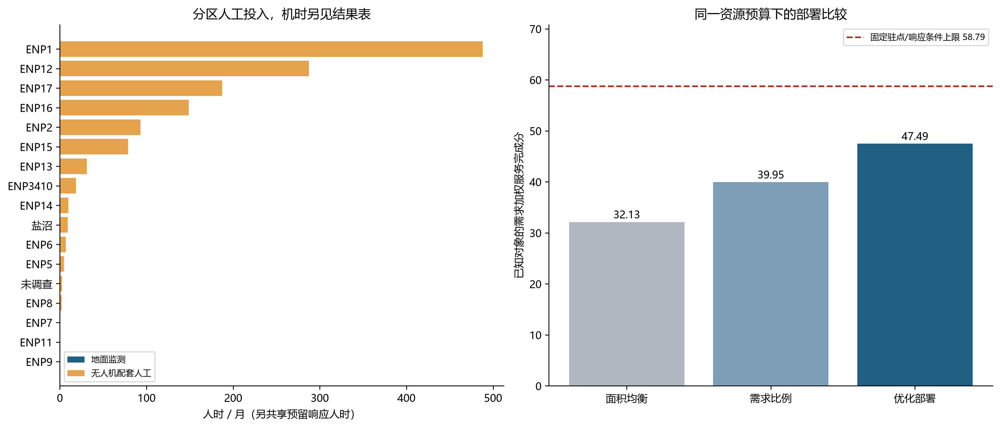
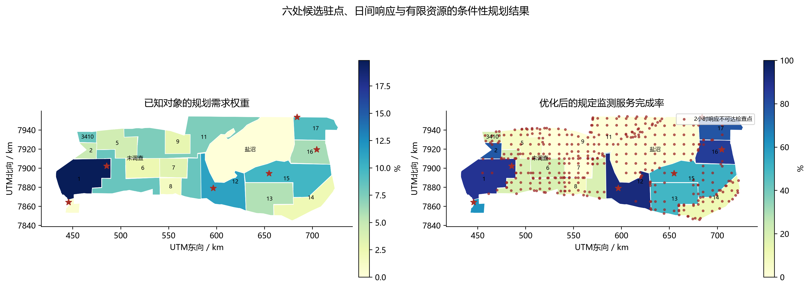

# 第二题：有限资源下的地面响应与无人机监测配置

## 数据与规划假设

本研究以17个分区组织资源，将10 km格网与分区相交后的各连通片设为代表性检查单元，共形成599个检查点。利用2015年六类动物调查、2021年WorldCover和2026年OSM道路，分别计算动物保护责任、可燃生境责任及道路进入便利度。对可猎、保护和特别保护三个类别建立团队判断的AHP矩阵，权重为 **0.1634、0.2970、0.5396**，一致性比率 **0.0079**；这些数值依据法规类别作比较，不是法定权重。动物数量先转为同物种的区域份额，防止数量多的物种主导评价；区内分布暂按面积均匀假设。

保护需求由反偷猎监测和可燃生境监测两个已知对象分项组成，管理权重暂取0.7和0.3。前者用动物责任乘道路进入指数后归一化，后者按可燃生境面积份额确定。由于尚无多年完整火暴露序列，后者采用等暴露规划假设，不解释为真实火灾风险。调查外动物值保持未知，不填零；盐沼及调查外区域保留通用监测底线，但该底线不能替代黑犀牛、鸟类和植物的专项要求。

降水仅作为独立气候背景。已提取GPCC 1971—2024年648个月的17区序列，以1971—2020年49个完整11月至次年4月雨季拟合Gamma分布并计算SPI-6。该六个月占各区基准年雨量约96%—97%，支持所选雨季窗口；2024年各区SPI为−1.11至−0.74。模型删除水点、地下水及专门水源工时，不由降水异常自动增加巡护需求。

| 共享规划条件 | 基准假设及用途 |
|---|---|
| 人员预算 | 题目295名部门工作人员中假设20%参与保护，每人每月120有效人时，合计7080人时；不是实测岗位配置 |
| 响应驻点 | 四处营地与两处入口作为六个候选点，每处2人、每日8小时、每月30日，共预留2880人时；仅分析日间窗口 |
| 技术预算 | 新增规划无人机6架，每架每日2机时、每月20作业日，合计240机时 |
| 监测标准 | 每100 km²每月8个标准检查点次，按面积分配，不随格网数改变总需求 |
| 通行与作业 | 道路30 km/h、道路外步行4 km/h；地面与无人机作业组均2人；单次观测10分钟、准备5分钟 |
| 飞行与响应 | 无人机40 km/h，单次安全飞行上限36分钟；调度10分钟，地面到场期限2小时 |

## 模型建立与求解

令检查单元 \(j\) 面积为 \(A_j\)，规定服务量 \(C_j=8A_j/100\)。令 \(x_j\)、\(h_j\) 为地面监测人时、无人机机时，\(s_j\) 为该单元规定服务完成率。沿有向路网计算候选驻点到检查点的去程和返程，另加道路外接近时间；地面单次人时 \(a_j\) 包含往返、准备、观察及两名队员。无人机在附近道路部署，单次机时 \(b_j\) 包含空中往返与观察，配套人时 \(o_j\) 包含人员到部署点的地面往返、准备和飞行操作，因此无人机不会产生“免费人工”。

设 \(r_j\in\{0,1\}\) 表示该单元能否在规定期限内获得地面响应，需求权重 \(w_j\) 合计为1。求解：

\[
\max P=100\sum_j w_js_j,
\quad C_js_j\leq\frac{x_j}{a_j}+\frac{h_j}{b_j},
\quad 0\leq s_j\leq r_j,
\]

\[
\sum_j x_j+\sum_j\frac{o_j}{b_j}h_j+H_0\leq H,
\qquad \sum_jh_j\leq U.
\]

无人机不适用的单元限制 \(h_j=0\)；每区至少完成其可响应部分15%的面积加权服务，防止已知权重较低区域被完全放弃。两类资源配比由模型决定，现场处置由已预留的地面队伍承担。以HiGHS求解线性规划，再在保持最优服务的条件下最小化人工消耗，选择同分解中的节省人时方案。连续点次是战略规划近似，不是逐日飞行或排班表。\(P\)仅衡量所选已知对象的监测服务，不能解释为动物存活率或完整全园保护认证。

## 结果与部署建议

基准预算下，三种部署均达到固定地理条件的 **58.79** 分上限。优化方案使用 **144.57** 机时和 **2408.4** 配套人时，加上2880响应人时，共 **5288.4** 人时；在本观测协议假设下，可替代筛查由无人机完成，地面人员负责部署、核查响应。关闭无人机仍能达到同分，但需6244.1人时，说明此时技术主要节省人工，尚不能突破响应范围。基准人时尚有余量，不能宣称调整分配在该情景下提高了评分。

将可用人时减少40%至4248后，固定响应预留不变，余下1368人时需要竞争配置。此时优化部署取得 **47.49** 分，比面积均衡和需求比例部署分别高15.36、7.54个百分点；使用96.22机时。若同一紧缺情景停用无人机，优化分数下降至39.45，技术替代的收益开始体现。基准与紧缺情景的对照见表和图1。

| 部署方式 | 基准7080人时：服务分 | 紧缺4248人时：服务分 |
|---|---:|---:|
| 面积均衡 | 58.79 | 32.13 |
| 需求比例 | 58.79 | 39.95 |
| 优化部署 | 58.79 | 47.49 |

基准方案的主要人工投入集中于ENP1、ENP12、ENP15、ENP13、ENP17；表中人工已含无人机配套人员，不另与机时相加。完整17区结果见计算附表。ENP9及部分北部单元的低分主要来自当前候选驻点和道路下的响应限制，不能据此认定这些区域没有保护价值。

| 区域 | 需求权重/% | 监测配套人工/人时 | 无人机/机时 | 面积加权服务完成/% |
|---|---:|---:|---:|---:|
| ENP1 | 19.84 | 487.9 | 29.3 | 87.9 |
| ENP12 | 11.29 | 385.6 | 26.9 | 92.5 |
| ENP15 | 9.86 | 352.5 | 19.9 | 52.3 |
| ENP13 | 5.70 | 282.7 | 13.1 | 49.9 |
| ENP17 | 9.22 | 214.1 | 15.6 | 77.6 |

在相同总资源上限下，另枚举三处现有道路节点作为新增前置响应点，并计入每月额外480响应人时。三个候选中，面向ENP5目标、位于 \(14.96728^\circ E,18.77332^\circ S\) 的道路节点效果最好，使服务分提高至 **65.65**；该位置是建模候选，不是现有保护站，也不是全园选址的全局最优证明。因此建议先核验北部/西北部前置响应的通行条件，再决定是否增加技术，而不是仅增加飞行时间。

道路速度20/40 km/h时，在固定基准需求权重下，评分分别为36.79/66.10；这反映通行与到场能力的敏感性。放宽到场期限至3小时得到75.53分，但同时改变了保护标准，不能称真实保护改善。保持单位面积服务标准，5/10/15 km检查格网分别得到58.01/58.79/61.98分，说明边界和代表点仍有尺度影响。以上配置依赖历史动物、候选道路权限、等火暴露及合格观测可替代假设，应以巡护/飞行日志校准；缺失的重点对象数据不能用较高平均分补偿。

## 资料与计算附件

原题参考人员数与资源要求；[2015航空调查](https://rhinoresourcecenter.com/wp-content/uploads/2022/01/1642693511.pdf)；[法规汇编](https://namibiatradeportal.gov.na/application/files/3617/2986/2681/Nature_Conservation_Ordinance_4_of_1975.pdf)；[AHP方法](https://doi.org/10.1504/IJSSCI.2008.017590)；[WorldCover](https://esa-worldcover.org/en/data-access)；[OSM/Geofabrik](https://download.geofabrik.de/africa/namibia.html)；[SPI说明](https://www.droughtmanagement.info/standardized-precipitation-index-spi/)。法规类别的数值判断、人员参与比例、检查频次、设备与工时均为团队规划假设。

[完整结果JSON](../../output/question2/q2_results.json)、[17区基准配置](../../output/question2/q2_regional_allocation.csv)、[紧缺配置](../../output/question2/q2_scarce_regional_allocation.csv)、[技术与质检说明](../modeling_notes/question2_calculation_notes.md)。
