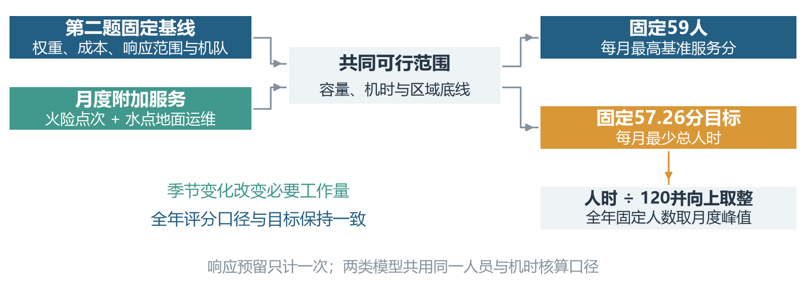
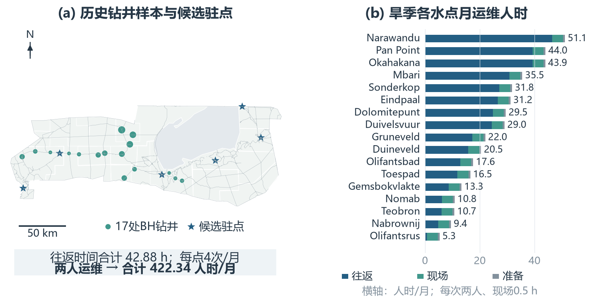
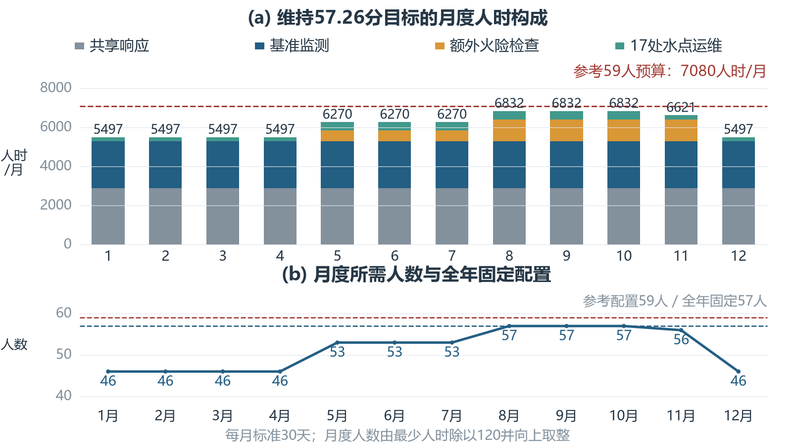
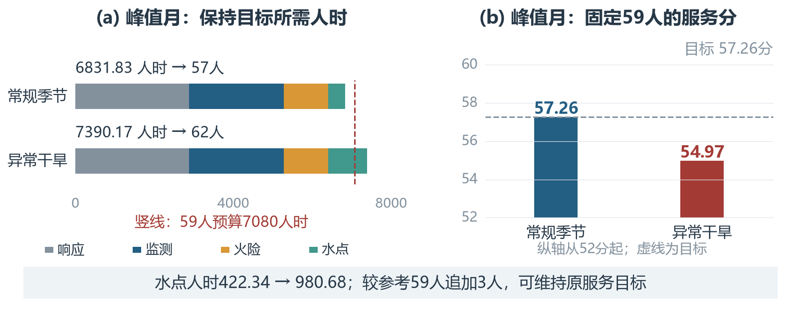

# 第三题正式正文

# 3 季节需求下的保护服务评估与人员需求模型

第二题给出了固定资源与地理条件下的保护服务配置。第三题进一步考虑季节任务的变化，回答两个问题：固定保护岗位人数时，各月能够保持多少服务；保持同一服务目标时，各月需要多少人。为此，在原监测任务上增加季节火险筛查和人工水点运维，建立共享约束下的两类线性规划，再把最少人时转换为月度及全年固定人数。图3-1给出计算关系。

图3-1：第二题基线、季节工作量与两类月度优化模型的计算关系。

## 3.1 服务目标与基本设置

### 3.1.1 第二题接口与基准服务目标

沿用第二题的17个父区\(\mathcal I\)、599个检查单元\(\mathcal J\)、区内集合\(\mathcal J_i\)和六处候选驻点\(\mathcal B\)。固定单元需求权重\(w_j\)、月规定检查数\(C_j\)、地面成本\(a_j\)、机时成本\(b_j\)、无人机配套人时系数\(\gamma_j\)、响应指示\(r_j\)及无人机适用集合\(\mathcal J_U\)。令\(\mathcal J_R=\{j:r_j=1\}\)。道路、权重和基准检查协议采用原输入，以保证月度结果可比较。

设\(s_{jt}\)为单元\(j\)在月份\(t\)的基准检查完成率，则
\[
P_t=100\sum_{j\in\mathcal J}w_js_{jt},\qquad \sum_jw_j=1.
\tag{3-1}
\]
分值表示需求加权的规定监测服务完成程度。季节新增任务作为必须满足的作业要求，不另加评分权重，因此一个方案只有满足该月火险筛查与水点运维要求，才进入服务分比较。

选择保持第二题原六处布局下已经实现的最优服务，取
\[
\eta=P_2^*=57.26016128\ldots.
\tag{3-2}
\]
目标的数值来自已有优化；全年保持该水平是本研究采用的管理规则。计算使用完整精度，正文显示为57.26分。由于\(0\le s_{jt}\le r_j\)，有
\[
P_t\le P_{\mathrm{geo}}=100\sum_jw_jr_j.
\tag{3-3}
\]
本基线中\(P_2^*=P_{\mathrm{geo}}\)。因此，人数充足时可维持目标，却不能仅靠增加人时使分数超过固定响应布局的上限。该服务目标沿用第二题的定义，不能直接解释为生态损失降低比例。

### 3.1.2 月度口径与资源参数

以\(\mathcal T=\{1,\ldots,12\}\)为规划期，各月标准化为30天，仅考察规定日间服务。单人有效工时固定\(q=120\)小时/人月，不再随季节扣减。295人为原题部门工作人员参考数，沿用20%的保护岗位参与假设，得到
\[
N_0=295\times0.2=59,\qquad H^{\mathrm{ref}}=qN_0=7080\ \text{人时/月}.
\tag{3-4}
\]
固定共享响应预留\(H_0=2880\)人时/月、无人机预算\(U=240\)机时/月。允许逐月重新配置监测与火险作业，但人员、机队不能在不同任务之间重复占用。主要设置见表3-1。

表3-1：继承输入与月度规划设置

| 设置 | 数值或定义 | 来源与用途 |
| --- | --- | --- |
| 空间与服务基线 | 17父区、599单元；原权重与成本 | 继承第二题 |
| 人数与有效工时 | 59人；120小时/人月 | 沿用参与比例与有效工时假设 |
| 日间响应预留 | 2880人时/月 | 六候选驻点的共享响应 |
| 无人机预算 | 240机时/月 | 基准监测与火险共用 |
| 规划时期 | 12个标准30天月 | 按月求解、允许重新配置 |
| 人工水点样本 | 17处BH钻井 | 2013年历史样本，情景中假设需维护 |

注：候选驻点及岗位参与比例为规划设定；历史水点样本不代表当前全园完整运行清单。

## 3.2 季节服务工作量

### 3.2.1 季节窗口与月份划分

埃托沙东北部的一项研究按5—10月旱季、11—4月湿季分析季节变化[season]，本研究采用其时间分类作为规划基线。官方火管理策略区分5—7月早期窗口和8—11月晚期窗口[fire]，据此安排额外火险筛查。两类时间窗口交叉后形成表3-2的四组月份；11月水点访问恢复湿季规则，火险加密仍持续。

表3-2：中档季节窗口与新增服务规则

| 月份 | 水点规则 | 目标间隔/天 | \(f_t\)/次 | \(k_t\)/点次 |
| --- | --- | --- | --- | --- |
| 1—4月、12月 | 湿季常规 | 15 | 2 | 0 |
| 5—7月 | 旱季、早期火窗口 | 7.5 | 4 | 2 |
| 8—10月 | 旱季、晚期火窗口 | 7.5 | 4 | 4 |
| 11月 | 湿季、晚期火窗口 | 15 | 2 | 4 |

注：\(f_t\)为每水点每月访问次数；\(k_t\)为每100 \(\mathrm{km}^2\)可燃生境每月额外检查点次。正常现场耗时均设为0.5小时/次。

时间分类有资料依据；表中的具体服务频次是本研究的中档规划设定。它们将季节差异转为可计算的任务量，不作为公园现行定额或逐月火灾预测。全年使用同一基准检查需求\(C_j\)，季节加密单独核算。

### 3.2.2 额外火险检查需求

可燃生境越多，需要额外筛查的支持面积越大。令\(\rho_i^F\)为父区\(i\)可燃生境面积占本区面积的比例，采用第二题同口径面积\(A_j\)，将父区比例下分至单元：
\[
A_j^F=\rho_{i(j)}^F A_j,\qquad 0\le\rho_i^F\le1.
\tag{3-5}
\]
这是区域比例近似，不表示已观测到逐单元实际燃料。设\(A_{\mathrm{ref}}=100\ \mathrm{km}^2\)，\(k_t\)为每参考面积每月额外检查点次，则
\[
D_{jt}^{\mathrm{all}}=k_t\frac{A_j^F}{A_{\mathrm{ref}}},\qquad
D_{jt}=r_jD_{jt}^{\mathrm{all}}.
\tag{3-6}
\]
\(D_{jt}^{\mathrm{all}}\)为全支持范围的计划量，\(D_{jt}\)为固定驻点能够提供响应支持的必要任务。中档取常规月\(k_t=0\)、5—7月\(k_t=2\)、8—11月\(k_t=4\)。新增检查沿用原观察清单和单位作业成本，由地面或适用无人机完成；每次加密任务独立核算，不把基准检查同时算作新增检查。

固定响应范围外的计划量记为
\[
D_t^{\mathrm{out}}=\sum_j(1-r_j)D_{jt}^{\mathrm{all}}.
\tag{3-7}
\]
晚期窗口可响应新增量为275.76点次/月，另有428.45点次/月位于响应范围外。后者单独报告，当前人时模型不将其记为已完成。本题增加的是预防性筛查与异常发现，不估计扑救或计划燃烧人时。

### 3.2.3 人工水点运维人时

水点保障需要人员到场检查抽水设备、清理和进行小修。官方年报记录了埃托沙水点的太阳能系统改造[annual]，支持以设备运维而非假定运水体积作为新增任务。本研究从2013年5月调查的42条水点记录中选取17处BH钻井样本，记为\(\mathcal L\)；天然泉不计入抽水系统运维[water]。假设这17处样本在所分析情景中需要维护，其现时运行状态及完整清单仍需校准。

将访问目标间隔\(\delta_t\)转换为标准月频次：
\[
f_t=\left\lceil\frac{30}{\delta_t}\right\rceil.
\tag{3-8}
\]
中档湿季、旱季目标间隔分别15、7.5天，对应2、4次/月。该式确定月度工作量；实际访问日期需另排，月度LP不直接保证每次间隔。

对水点\(\ell\)，分别在原有向路网上计算各候选驻点的完整去返程，保留单行约束。设\(d_{b\ell}^{+},d_{\ell b}^{-}\)为去返程等效道路距离，\(d_\ell^\perp\)为道路外接近距离，采用道路速度\(v_g=30\)、步行速度\(v_w=4\ \mathrm{km/h}\)，则
\[
T_\ell^{\mathrm{rt}}=
\min_{b\in\mathcal B:\ d_{b\ell}^{+},d_{\ell b}^{-}<\infty}
\left(\frac{d_{b\ell}^{+}+d_{\ell b}^{-}}{v_g}+
\frac{2d_\ell^\perp}{v_w}\right).
\tag{3-9}
\]
这是预先安排的维护出行，不受事件两小时到场门槛限制；仍必须具备有限往返路径。各次出行独立计算，暂不抵扣串点维护的共享路程。图3-2将点位与成本构成并列，说明相同频次下路线差异仍会改变人时。

图3-2：历史钻井样本与旱季运维成本。左图圆点表示17处BH样本，星形为六候选驻点；右图各点人时分为往返、现场与准备。2013年点位配合固定道路快照，当前运行状态未知；地图不表示实际维护轨迹。

设两人运维组\(n_W=2\)，现场耗时\(\tau_t\)，每次准备时间\(t_p^W=1/12\)小时。一次作业先合计队伍占用时间，再乘人数，得到
\[
a_{\ell t}^{W}=n_W\left(T_\ell^{\mathrm{rt}}+\tau_t+t_p^W\right),\qquad
W_t=\sum_{\ell\in\mathcal L}f_ta_{\ell t}^{W}.
\tag{3-10}
\]
其中\(a_{\ell t}^W\)为人时/次，\(W_t\)为必要地面人时/月。17处合计往返时间为42.87565小时，正常现场耗时假设为0.5小时，因此
\[
\begin{aligned}
W_{\mathrm{wet}}&=2\times2\left[42.87565+17\left(0.5+\frac1{12}\right)\right]
\approx 211.17,\\
W_{\mathrm{dry}}&=4\times2\left[42.87565+17\left(0.5+\frac1{12}\right)\right]
\approx 422.34.
\end{aligned}
\tag{3-11}
\]
两项单位均为人时/月。无人机不能替代现场维护，故\(W_t\)作为给定必要人工直接进入总预算。访问频次、现场耗时与两人队伍是显式规划假设；路线时间由既有路网计算。

## 3.3 月度服务评估与人时优化

### 3.3.1 决策变量与共同约束

在第二题变量上增加月份下标，并为额外火险任务设独立投入。表3-3列出五组决策量；水点人时\(W_t\)由式（3-10）预先计算，人数则在求解后换算，二者均不是本LP的自由变量。

表3-3：月度线性规划的五组决策变量

| 符号 | 含义 | 单位 |
| --- | --- | --- |
| \(x_{jt}\) | 基准监测地面投入 | 人时/月 |
| \(h_{jt}\) | 基准监测无人机投入 | 机时/月 |
| \(s_{jt}\) | 基准规定检查完成率 | 无量纲，0至\(r_j\) |
| \(y_{jt}\) | 额外火险检查地面投入 | 人时/月 |
| \(v_{jt}\) | 额外火险检查无人机投入 | 机时/月 |

注：\(a_j,b_j,\gamma_j,C_j,D_{jt},W_t\)均为输入；\(N_t^{\mathrm{plan}}\)为求解后换算结果。

定义地面与无人机单位时间的检查容量系数：
\[
g_j=\begin{cases}1/a_j,&j\in\mathcal J_R,\\0,&j\notin\mathcal J_R,\end{cases}
\qquad
u_j=\begin{cases}1/b_j,&j\in\mathcal J_U,\\0,&j\notin\mathcal J_U.\end{cases}
\tag{3-12}
\]
以零系数统一处理技术不适用单元，避免使用其未定义成本。完成率\(s_{jt}\)对应完成\(C_js_{jt}\)点次，投入能够支持的点次为\(g_jx_{jt}+u_jh_{jt}\)，故基准服务必须满足
\[
C_js_{jt}\le g_jx_{jt}+u_jh_{jt},\qquad j\in\mathcal J.
\tag{3-13}
\]
额外火险筛查是必要任务，不设可被压低的完成率，要求
\[
D_{jt}\le g_jy_{jt}+u_jv_{jt},\qquad j\in\mathcal J.
\tag{3-14}
\]
两条约束使用相同单位成本，但各自对应不同检查点次。可在两种方式之间选择或分摊任务；同一次作业不能在两条约束中重复记为完成。

基准监测和额外火险检查共用机队，因此机时上限为
\[
\sum_{j\in\mathcal J_U}(h_{jt}+v_{jt})\le U=240.
\tag{3-15}
\]
沿用第二题区域通用服务底线，以\(\mu_j=A_j/A_{i(j)}\)表示区内面积份额，要求
\[
\sum_{j\in\mathcal J_i}\mu_js_{jt}\ge
\beta\sum_{j\in\mathcal J_i}\mu_jr_j,
\qquad i\in\mathcal I,\quad \beta=0.15.
\tag{3-16}
\]
底线以本区可响应部分为基准，避免某区因目标权重低而完全退出通用检查；其含义保持为面积加权服务，不另转成单个单元15%底线。

变量还满足
\[
\begin{aligned}
&0\le s_{jt}\le r_j,\quad x_{jt},h_{jt},y_{jt},v_{jt}\ge0,&&j\in\mathcal J,\\
&x_{jt}=y_{jt}=0,&&j\notin\mathcal J_R,\\
&h_{jt}=v_{jt}=0,&&j\notin\mathcal J_U.
\end{aligned}
\tag{3-17}
\]
无人机投入还占用运输、准备及操作人工。令基准监测和新增火险的人工分别为
\[
H_t^B=\sum_{j\in\mathcal J_R}x_{jt}+\sum_{j\in\mathcal J_U}\gamma_jh_{jt},\qquad
H_t^F=\sum_{j\in\mathcal J_R}y_{jt}+\sum_{j\in\mathcal J_U}\gamma_jv_{jt}.
\tag{3-18}
\]
其中\(\gamma_j=o_j/b_j\)，表示每机时需要的配套人时。总消耗为
\[
H_t(\mathbf z_t)=H_0+W_t+H_t^B+H_t^F,
\qquad \mathbf z_t=(\mathbf x_t,\mathbf h_t,\mathbf s_t,\mathbf y_t,\mathbf v_t).
\tag{3-19}
\]
响应预留\(H_0\)只计一次，水点作业完整计入，所有监测任务共用其余人工。将式（3-13）—（3-17）定义的可行集合记为\(\mathcal F_t\)；该集合包含容量、适用性、机时和区域底线，尚未加入人员预算或总分目标。

### 3.3.2 固定人数的服务水平评估

给定参考人数\(N_0=59\)，先满足当月必要水点和火险任务，再选择基准监测完成率，使同一评分最大：
\[
\boxed{\begin{aligned}
P_t^*(N_0)=\max_{\mathbf z_t}\quad&100\sum_jw_js_{jt}\\
\text{s.t.}\quad&\mathbf z_t\in\mathcal F_t,\\
&H_0+W_t+H_t^B+H_t^F\le qN_0.
\end{aligned}}
\tag{3-20}
\]
该模型直接回答固定人数下的月度服务能力。季节工作越多，可用于基准监测的人工与机时通常越少；但存在预算余量时，工作量增加不一定导致分数下降。定义目标缺口
\[
\Delta P_t=\max\{0,\eta-P_t^*(N_0)\}.
\tag{3-21}
\]
若预算无法完成必要任务与区域底线，模型返回不可行，该月份应报告配置不足，而非给出一个仍被称为达标的服务分。

### 3.3.3 固定目标的最小人时模型

为估计维持所选保护服务需要多少人，固定目标\(\eta\)，取消59人的人工上限，反求最少总人时：
\[
\boxed{\begin{aligned}
H_t^*(\eta)=\min_{\mathbf z_t}\quad&H_0+W_t+H_t^B+H_t^F\\
\text{s.t.}\quad&\mathbf z_t\in\mathcal F_t,\\
&100\sum_jw_js_{jt}\ge\eta.
\end{aligned}}
\tag{3-22}
\]
保持设备上限与共同服务要求，让求解器在地面和无人机投入之间选择省人工的组合。这里不同时施加7080人时上限，否则需求超过59人时只能判无解，不能估计追加人数。\(H_0,W_t\)虽为单月常数、不会改变该月最优作业组合，仍须加入最少总人时用于人数换算。

服务向量\(\mathbf s_t\)允许在同分条件下重新选择，不能把第二题某个代表解的消耗直接当作全局最少人工。去掉所有季节新增工作后，本模型得到5286.11人时；固定第二题原服务向量则复现5288.37人时。约2.26人时的差异来自零评分权重单元的区域底线配置变化，目标分相同。

## 3.4 求解与人员需求换算

### 3.4.1 月度求解与基本核验

各月依次读取第二题输入、生成\(D_{jt},W_t\)、组装共同约束，再分别求解式（3-20）和（3-22）。五组单元变量共2995个，系数固定后目标和约束均为线性函数；采用稀疏矩阵与HiGHS求解。相同季节参数的月份可复用计算结果。

保存解经独立脚本重新核算点次容量、必要任务、区域底线、人员与机时预算以及总评分，84个已保存可行方案通过核验。高于地理上限的目标被拒绝，人工低于固定响应需要时返回不可行。数值处理和逐项结果见计算附件；月度连续工作量用于规划，未构造个人详细排班。

### 3.4.2 月度人数与全年固定配置

由每人120小时/月的有效工时，把最少人时向上取整：
\[
N_t^{\mathrm{plan}}=\left\lceil\frac{H_t^*(\eta)}{q}\right\rceil,
\qquad q=120.
\tag{3-23}
\]
若全年人数固定且不依赖跨月转移工时，则每个月都必须具备足够容量，所以
\[
N_{\mathrm{year}}^{\mathrm{plan}}=\max_{t\in\mathcal T}N_t^{\mathrm{plan}}.
\tag{3-24}
\]
各月人数是同一批岗位在不同月份的需求，不能相加；年均工作量也不能保证峰值月达标。按这一方法得到的是当前任务与月度容量口径下的规划人数。

## 3.5 结果与人员配置解释

### 3.5.1 固定59人的月度服务

中档季节规则下，固定59人在12个月均达到57.26分，\(\Delta P_t=0\)。图3-3显示，月工作量随季节上升，但最大6831.83人时仍低于7080人时，峰值余量248.17人时；该结果说明新增任务先消耗预算余量。基准目标已经等于地理上限，因此余量不会进一步提高该布局下的评分。

图3-3：中档季节规则下的月度人时构成与人员需求。上图完整计入四类任务并与59人预算比较；下图显示各月所需人数及57人的全年固定配置。

### 3.5.2 季节人时与全年人数

表3-4给出四类月份的最少人工和机时。5—7月同时增加水点频次与早期火险筛查；8—10月额外火险频次进一步增加，形成全年峰值；11月水点频次降低，但晚期火险筛查仍持续。

表3-4：维持同一服务目标的季节资源需求

| 月份 | 最少人时/月 | 规划人数 | 使用机时/月 | 59人服务分 |
| --- | --- | --- | --- | --- |
| 1—4月、12月 | 5497.28 | 46 | 144.34 | 57.26 |
| 5—7月 | 6270.14 | 53 | 177.48 | 57.26 |
| 8—10月 | 6831.83 | 57 | 210.61 | 57.26 |
| 11月 | 6620.66 | 56 | 210.61 | 57.26 |

注：最少人时含共享响应、监测配套人工、额外火险与水点运维；人数按120小时/人月向上取整。

峰值人工分解为
\[
H_{\mathrm{peak}}^*=2880+2406.11+1123.38+422.34
=6831.83\ \text{人时/月}.
\tag{3-25}
\]
四项依次是响应预留、基准监测、额外火险和水点运维。由式（3-23）—（3-24）得到全年固定57人，11月仍需56人。峰值月56人可实现的最高分为56.73，低于目标，因此不能将57人再减少一人。

### 3.5.3 异常干旱下的追加人员

为考察较重的水点保障任务，在旱季将目标访问间隔设为3.75天，即8次/月，并把每次现场作业增至1小时；其余服务定义、成本及机时预算沿用中档设置。这是异常干旱下的条件性运维压力情景，未由降雨或事故数据预测。必要水点人工增加至980.68人时/月。

图3-4显示，8—10月维持原目标需要7390.17人时，全年固定人数上升至62；固定59人的峰值服务为54.97分，低于目标2.29分。因此，相对参考59人配置需追加3个同口径岗位；相对常规季节57人方案则增加5人。具体服务参数的敏感性和模型评价分别在第四、五题讨论。

图3-4：常规季节与异常干旱的峰值月对照。左图比较维持57.26分所需人时，右图比较固定59人的最高服务分；右图纵轴从52分起。异常干旱只提高水点访问频次与现场耗时。

**本部分资料与图表设计参考**

- [Interplay of physical and social drivers of movement in male African savanna elephants，2024，原研究数据说明](https://datadryad.org/dataset/doi:10.5061/dryad.4qrfj6qm3) [season]
- [Namibia Fire Management Strategy，2016，Etosha章节](https://www.meft.gov.na/files/downloads/66c_Fire%20Management_Strategy%20Final%20Version.pdf) [fire]
- [Riddell等，Groundwater stable isotope profile of the Etosha National Park, Namibia，Koedoe，2016，58(1)，a1329](https://koedoe.co.za/index.php/koedoe/article/view/1329/1890) [water]
- [MEFT Annual Report 2021/2022，水点系统改造记录](https://www.meft.gov.na/files/downloads/MEFT%20Annual%20Report%202021-2022.pdf) [annual]
- [Deploying PAWS: Field Optimization of the Protection Assistant for Wildlife Security，2016（图表表达参考）](https://doi.org/10.1609/aaai.v30i2.19070) [paws]
- [Improving Community-Participated Patrol for Anti-Poaching，2025（图表表达参考）](https://doi.org/10.1609/aaai.v39i27.35072) [community]

图件由本项目固定输入与保存解原创绘制；模块流程参考PAWS的Figure 5，多面板地图及资源比较参考社区巡护研究的Figure 3。

计算附件：[完整月度结果](../../output/question3/q3_results.json)、[月表](../../output/question3/q3_monthly.csv)、[独立核验](../../output/question3/q3_independent_verification.json)、[参数假设](../../data/modeling/q3_assumptions.json)、[计算记录](../第三题模型实算.md)、[图表设计来源](../modeling_notes/q3_figure_design_references.md)。
