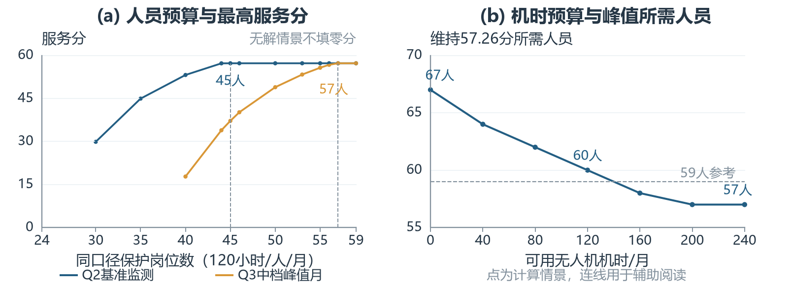
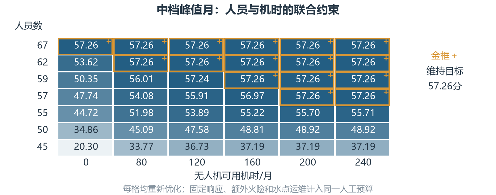

# 第四题正式正文

# 4 敏感性与情景分析

第二、三题给出了基准部署和季节人员需求，本部分进一步检验资源或作业条件改变时，原策略能否维持既定服务。沿用需求权重、检查协议和区域底线，将第二题基准监测与第三题中档峰值月分别作为比较对象；后者包含额外火险检查和17处历史钻井水点样本运维。单人有效工时固定为120小时/月，目标保持\(\eta=P_2^*\approx57.26\)分。以下情景是规划条件的改变，不赋予发生概率。

## 4.1 资源敏感性分析

### 4.1.1 人员减少对保护服务的影响

保持机时预算240及地理条件不变，改变保护岗位数，分别求固定人员下的最高服务与目标下的最少人工：
\[
\begin{aligned}
P_t^*(N,U)&=\max_{\substack{\mathbf z_t\in\mathcal F_t(U)\\H_t(\mathbf z_t)\le120N}}100\sum_jw_js_{jt},\\
H_t^{\mathrm{crit}}(U)&=\min_{\substack{\mathbf z_t\in\mathcal F_t(U)\\100\sum_jw_js_{jt}\ge\eta}}H_t(\mathbf z_t).
\end{aligned}

\tag{4-1}
\]
其中\(\mathcal F_t(U)\)沿用服务容量、技术适用性、区域底线及必要任务约束；第二题比较关闭新增季节任务。共享响应2880人时不随人员同比削减。低预算下若连必要任务与底线都无法完成，报告无解，不以零分代替。

图4-1(a)显示两种工作范围的差别。在240机时条件下，第二题基准服务的全局最少人工为5286.11人时，按有效工时换算需45个同口径岗位；中档峰值月需6831.83人时，即57人。峰值月减至56人时只有56.73分。新增工作使人员阈值提高，即使基准服务分相同，也不能将第二题剩余预算直接视为全年可减员空间。本节反求允许同分服务向量重新选择，与第二题固定服务向量的代表人工消耗口径不同。

图4-1：人员资源、机时资源与服务目标的关系。两类工作范围分别求解；点为已算情景，连线仅辅助阅读。

### 4.1.2 无人机减少与人力替代

按每架每月40机时的设定，将机时上限由240逐步降至0，保留无人机配套人工及地面响应。图4-1(b)中，峰值所需人数依次随设备减少而增加：240机时需57人，160机时需58人，120机时需60人，设备停用需67人。机时减半时最少人工为7086.48人时，比59人的7080人时预算略高，因而仍不能严格保持目标。

这表明地面检查能够在技术不足时补充服务，但要付出更多人工；响应与水点运维仍不能由飞行机时替代。资源充足时，设备变化可能只增加工作量而不改变分数。因此同时报告服务分和所需人工，比只比较总分更能体现技术的作用。上述人数针对选定任务与既定响应范围，不代表公园实际编制。

## 4.2 关键参数敏感性分析

### 4.2.1 通行与作业条件的影响

道路速度改变同时影响响应可达性与往返成本，作业耗时增加则直接提高人工消耗。保持第二题基准评价权重，表4-1汇总已有通行情景。道路速度由30降至20 km/h时，分数降至35.76，且等于该条件下的地理上限；增加人员也不能修复现有驻点无法及时响应的区域。该情景总人工较少，是服务范围缩小的结果，不能解释为效率提高。

表4-1：通行与作业成本情景（第二题工作范围）

| 情景 | 服务分 | 地理上限 | 使用人时 |
| --- | --- | --- | --- |
| 道路20 km/h | 35.76 | 35.76 | 4511.76 |
| 道路30 km/h | 57.26 | 57.26 | 5288.37 |
| 道路40 km/h | 64.69 | 64.69 | 5479.67 |
| 作业人工增加25% | 57.26 | 57.26 | 5889.48 |

注：沿用第二题固定服务向量的代表成本；道路情景保持基准评价权重。

相比之下，作业人工增加25%后仍为57.26分，但代表方案消耗升至5889.48人时，说明评分达到上限会遮盖成本变化。前者需改善通行或响应布局，后者需保留人工余量。速度和成本变化是明确的压力设定，并非本园实际运行速度或耗时的统计区间。

### 4.2.2 季节服务要求的影响

在中档峰值月分别改变额外火险检查频次、水点访问频次及现场耗时，每次只改变一项。表4-2显示，火险检查加密对人员需求的影响较大，但这一比较只限表中所选幅度，不构成所有参数的普遍排序。水点工作量满足
\[
W_t=f_tn_W\left[\sum_{\ell\in\mathcal L}T_\ell^{\mathrm{rt}}+
|\mathcal L|(\tau_t+t_p^W)\right].

\tag{4-2}
\]
其中\(f_t\)为每点月访问次数，\(n_W=2\)，\(\tau_t\)为现场小时数。对17处样本，保持每月4次访问时，现场时间由0.5增至1小时会增加68人时；人数由57增至58。不同工时变化可能得到同一取整人数，因此不能只看整数结果。

表4-2：单独改变服务要求时的峰值人数

| 变化因素 | 测试取值 | 对应人数 |
| --- | --- | --- |
| 额外火险频次 \(k_t\) | 2 / 4 / 8 | 53 / 57 / 67 |
| 水点月访问次数 \(f_t\) | 2 / 4 / 8 | 56 / 57 / 61 |
| 现场耗时 \(\tau_t\)/小时 | 0.25 / 0.5 / 1 | 57 / 57 / 58 |

注：每行其余条件保持中档峰值基准；\(k_t\)单位为每100平方公里可燃生境每月额外点次。

同时改变服务要求的低、中、高档组合，正常季节峰值为51、57、72人；所设异常干旱运维压力下为53、62、78人。这些是不同管理规则下的结果，不能当置信区间。若只按样本平均成本把水点工作量增至2、3倍，中档峰值为61、64人；该检验揭示完整台账的重要性，不表示已查明新增水点数量和路线。赋权与格网对照另存计算附件，不能以不同评分口径的分数直接判断保护改善。

## 4.3 情景分析与策略调整

### 4.3.1 巡护时间安排的比较

月度点次相同不意味着服务在时间上同样连续。以中档旱季17处水点为代表，每点访问4次，比较相位错开的分散安排与全部集中在第1—4日的安排。分散方案在重复30日周期内采用相隔7、8、7、8日的日期，并逐点错开起始日；集中方案也按相同月周期重复。两者均为构造日程，任务数和独立往返成本保持一致。

表4-3：同月任务量下的水点访问时间对照

| 安排 | 访问次数 | 月人时 | 最长间隔/日 | 单日峰值人时 |
| --- | --- | --- | --- | --- |
| 分散并错开 | 68 | 422.34 | 8 | 15.48 |
| 集中第1—4日 | 68 | 422.34 | 27 | 105.58 |

注：整数日期、重复30日周期；分散相位采用逐点降低当前峰值的启发式，不称全局最优日程。

表4-3中，两种方案均为68次、422.34人时，但集中执行使最长访问间隔达到27日，单日水点人工峰值也明显增加。分散安排的最长间隔为8日，这是整数日期下对7.5日理想均匀间隔的近似，尚不能证明严格满足7.5日规则。因而月度LP可评估工作总量，实际应用还应核验访问日期和分时容量。这里仅比较水点任务，不证明整套巡护、飞行与响应排班可行，也未改变每人120小时的月有效工时。

### 4.3.2 联合压力下的部署调整

图4-2将人员与机时同时改变，并对每格重新优化中档峰值月服务。57人配200或240机时可以维持目标，配160机时仅为56.97分；59人配120机时为57.24分，而完全停用设备时降至50.35分。相同设备减少幅度在不同人工预算下影响不同，不能用单项资源充足时的结果外推联合压力。

图4-2：中档峰值月的人员与机时联合情景。数字为最高服务分，金框表示维持目标；各格预算和硬性任务均已核验。

为区分原部署的承受能力与重新配置的作用，以峰值基准服务向量\(\mathbf s^0\)为原空间规则。对正评价权重单元按同一比例缩减，零权重单元保持原底线服务，同时仍允许技术方式改变：
\[
s_j^{\mathrm{ret}}=
\begin{cases}\lambda s_j^0,&w_j>0,\\s_j^0,&w_j=0,\end{cases}
\qquad 0\le\lambda\le1.

\tag{4-3}
\]
额外火险及水点任务仍必须完成。通过比例搜索和原LP求出这一规则下可维持的最高服务，再与允许空间重新配置的解比较。该规则用于受限对照，不是已观测的公园制度。

表4-4：保留空间规则与重新配置的服务对照

| 情景 | 保留规则 | 重新配置 | 增加分数 |
| --- | --- | --- | --- |
| 中档：55人、240机时 | 51.72 | 55.71 | 3.98 |
| 中档：59人、120机时 | 57.14 | 57.24 | 0.10 |
| 干旱运维：59人、120机时 | 46.36 | 53.19 | 6.83 |

注：同一情景采用相同预算、权重和必要任务；技术方式在两种方案中均允许改变。

表4-4显示，55人情景下重新配置增加3.98分；异常干旱运维压力叠加120机时上限时增加6.83分，但仍未达到57.26分。部署调整可以缓解缺口，却不能保证所有资源压力下达标。管理上应根据重点月份的工作量保留人机余量，对地理缺口优先核验驻点和通行方案；这些建议仅覆盖已计算的条件，尚未验证实际生态减损。

计算附件：[情景结果](../../output/question4/q4_results.json)、[完整解](../../output/question4/q4_solutions.json)、[独立核验](../../output/question4/q4_independent_verification.json)。
