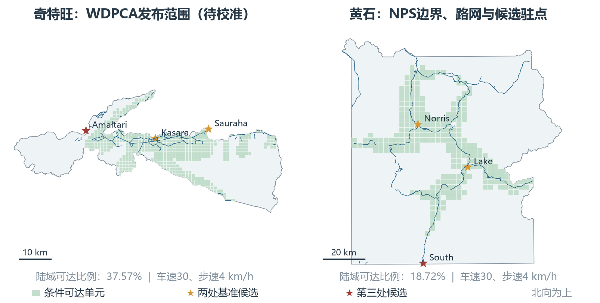
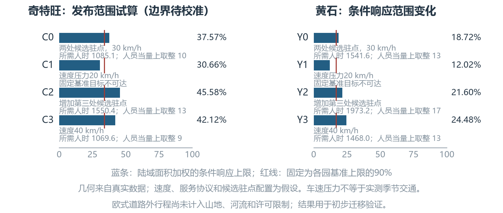

# 6 保护资源配置模型的跨大陆适配

第二、三题的方法如何用于其他大洲？本节选择亚洲的奇特旺国家公园和北美洲的黄石国家公园，保留“任务—通行时间—服务完成—所需人力”的关系，替换当地数据。本次使用真实发布边界、道路、位置点和土地覆盖，先计算陆域巡检任务；速度、频次和驻点配置仍为假设。所得人数只对应这些任务。奇特旺边界校准未通过，其数值仅适用于所用发布多边形。

**术语说明。**“空间单元”是计算用的网格；“人时”是一人工作一小时，两人一小时为两人时；“服务完成率”是规定检查量的完成比例；“服务分”按权重汇总完成率；“条件响应上限”是按所用地图和作业假设最多能取得的服务分；“人员当量”把任务工时除以120小时后向上取整。服务分不表示动物存活率，人员当量也不表示实际编制。

## 模型结构与迁移方法
### 共同结构与本地参数

用 \(j\) 表示单元、\(t\) 表示时期，\(s_{jt}\) 为完成率，\(w_j\) 为园内权重。服务分为
\[
P_t=100\sum_jw_js_{jt},\qquad \sum_jw_j=1.

\]
物种、生境和管理任务改变时，应重建权重，不能直接套用埃托沙的物种组合和熵权结果。本次不虚构动物分布，先按真实陆域面积赋权：\(w_j=A_j^{\mathrm{land}}/\sum_kA_k^{\mathrm{land}}\)。任务量为 \(C_j=8A_j^{\mathrm{land}}/100\)，面积单位为平方千米。均匀检查频次属于服务假设；永久水体不承担本次陆域任务。不同公园的分数只描述各自任务，不能横向比较生态好坏。

图6-1 真实数据、情景参数与当地校准的迁移关系

### 可达性、技术与工作量的重建

道路长度取自地图，通行时间由速度和许可决定。当前道路按双向通行情景计算，过滤明确私人或机动车禁止线路；只连接相距0.5米以内的制图端点，不补建跨河或长距离道路。实际管理通行权限仍需核实。

设道路去返程时间为 \(T_{jt}^{+},T_{jt}^{-}\)，道路外单程时间为 \(v_{jt}\)，派遣延迟为 \(\delta\)。响应资格与每次检查的人时成本为
\[\begin{aligned}
r_{jt}&=\mathbf{1}\{\delta+T_{jt}^{+}+v_{jt}\leq\overline{T}_j\},\\
a_{jt}&=n_j(T_{jt}^{+}+T_{jt}^{-}+2v_{jt}+\tau_j+\pi_j).
\end{aligned}\]
\(n_j\) 是同行人数，\(\tau_j,\pi_j\) 是观察、准备时间。驻点接入道路的距离也计入。道路外距离目前按直线估算，尚未处理坡度、跨河绕行和许可。因此 \(r_{jt}\) 表示模型内能否按时到场，地图缺失造成的不可达不能直接当作现实不可达。

用地面人时 \(x_{jt}\)、无人机机时 \(h_{jt}\) 支持任务。给定服务目标 \(\eta\)，反求最少人时：
\[
\begin{aligned}
\min\quad&H_t=H_{0t}+L_t+\sum_j(x_{jt}+\gamma_{jt}h_{jt})\\
\text{s.t.}\quad&C_{jt}s_{jt}\leq x_{jt}/a_{jt}+h_{jt}/b_{jt},\\
&0.15r_{jt}\leq s_{jt}\leq r_{jt},\quad x_{jt},h_{jt}\geq0,\\
&h_{jt}=0\ (m_{jt}=0),\quad\sum_jh_{jt}\leq U_t,\\
&100\sum_jw_js_{jt}\geq\eta.
\end{aligned}

\]
\(H_{0t}\) 是响应预留，\(L_t\) 是另测的社区、游客管理等工作；\(b_{jt}\) 是每次无人机检查的机时，\(\gamma_{jt}\) 换算配套人工，\(m_{jt}\) 表示授权和任务效果均满足条件。预算给定时，增加 \(H_t\leq H_t^{\max}\) 并最大化服务分即可回到第二题。未校准无人机效果和授权，本节 \(U_t=0\)；未测专属工作也尚未计入。埃托沙30架的设备规模不直接套用于两园。

表6-1 初步验证的作业假设；均不宣称当地实测标准

| 参数 | 设定 | 用途 |
| --- | --- | --- |
| 有效工时 | 120小时/人/月 | 与第三题一致 |
| 车速、步速 | 30、4 km/h | 车辆情景另设20、40 km/h |
| 派遣、观察、准备 | 10、10、5分钟 | 进入响应和检查成本 |
| 小队与服务密度 | 2人；8次/100平方千米/月 | 面积服务协议 |
| 响应与服务底线 | 2小时；15% | 与原模型结构一致 |
| 响应点预留 | 480人时/点/月 | 比较驻点固定工作量 |
| 无人机预算 | 0小时 | 授权及等效性未校准 |

有 \(K\) 个候选驻点时，响应预留及人数换算为
\[
H_0=K\times2\times8\times30=480K,\qquad
N=\left\lceil H^{\min}/120\right\rceil.

\]

## 两类保护区的适配方案
### 奇特旺：重点物种、森林与季风通行

奇特旺重点对象包括独角犀和虎；森林巡护、河流生境与社区冲突任务需分别确定时效和技能。2013—2017年管理计划记载季风洪水和车辆通行限制（[UNESCO](https://whc.unesco.org/en/list/284)、[历史管理计划](https://faolex.fao.org/docs/pdf/nep220147.pdf)）。它支持按季节改变路线，但不提供本次20 km/h的依据；该速度只是压力情景。

空间计算采用WDPCA2026年10月发布的site805多边形及OSM道路（[WDPCA2026-10](https://data-gis.unep-wcmc.org/server/rest/services/ProtectedPlanet/WDPCA/FeatureServer/1)、[OSM/Geofabrik](https://download.geofabrik.de/asia/nepal.html)）。Kasara、Sauraha、Amaltari是真实具名位置，作为候选驻点的地理参考；Amaltari来自社区办公室记录，均未证实现有响应值守职责。

**边界校准未通过。**WDPCA报告面积932平方千米、源GIS与测地面积均约1213；投影结果1214.06平方千米比官方952.63大27.44%（[DNPWC报告](https://dnpwc.gov.np/media/files/UNESCO_Report_of_Chitwan_National_Park.pdf)、[DNPWC2020 GIS报告](https://giwmscdntwo.gov.np/media/pages/files/Final%20Report_GIS%20Database_v4olikj.pdf)）。投影仅使面积变化约0.087%，不能解释主要差异；官方2020年GIS报告仍列952.63。源几何与报告口径未闭合，尚未定位具体错误边段。故只做发布范围试算，不缩放凑面积；缓冲区另建范围。

WorldCover显示该范围林地占91.11%（[ESA WorldCover](https://esa-worldcover.org/en/data-access)）。森林和高草下的发现能力、复核时间需现场试验；河流交通、设备维护和社区协作应另记人时。修正边界后，面积、权重和结果均需重算。

### 黄石：游客交互、季节交通与技术权限

黄石应把动物监测、游客与动物交互、道路事件及偏远生境任务分别建模（[NPS游客管理](https://www.nps.gov/yell/learn/management/visitor-use.htm)）。游客数量不直接代替动物价值；需要分时客流、事件位置和处置日志，避免任务重复计算。

本次采用NPS边界、公开道路及位置点（[NPS边界](https://irma.nps.gov/DataStore/Reference/Profile/2316784)、[NPS道路](https://mapservices.nps.gov/arcgis/rest/services/NationalDatasets/NPS_Public_Roads/MapServer/0)、[NPS位置点](https://mapservices.nps.gov/arcgis/rest/services/NationalDatasets/NPS_Public_POIs_Geographic/FeatureServer/0)）。基准用Norris、Lake护林站位置，增设点采用South Entrance位置；位置真实，但角色和人员配置为方案。道路共2007条记录，核对后使用园内约619.60千米；公开图层缺少部分行政及作业道路。

冬季公众封路不等于管理人员无法到达，应另核实雪地装备与管理通行（[NPS通行条件](https://www.nps.gov/yell/planyourvisit/conditions.htm)）。未获园长书面批准，无人机不进入配置（[NPS规则](https://www.nps.gov/yell/learn/management/lawsandpolicies.htm)）。全园林地占62.93%，也不能将开阔谷地条件推广到整园。

表6-2 真实数据来源及正式部署需补充的校准数据

| 项目 | 奇特旺 | 黄石 |
| --- | --- | --- |
| 边界与道路 | WDPCA2026-10多边形；OSM2026-10-04道路。边界一致性未通过 | NPS边界、公开道路；需补护林作业道路 |
| 候选位置 | Kasara、Sauraha、Amaltari具名地理参考，设施待核定 | Norris、Lake、South Entrance护林站位置 |
| 生境分类 | ESA WorldCover2021v200 | ESA WorldCover2021v200 |
| 对象与需求校准 | 重点物种位置、调查努力、社区冲突与巡护日志 | 动物调查、游客分时暴露与事件处置日志 |
| 通行与技术校准 | 季风封路、河流通行、速度与技术试验 | 季节管理通行、坡度、工具可用性及授权 |

## 真实空间数据验证与部署变化

面积和长度在当地米制坐标中计算：奇特旺UTM45N、黄石UTM12N。WorldCover2021的10米原始分类采用最近邻方法采样到100米，保持类别编码；另以50米复核。奇特旺网格边长1千米，黄石2.5千米；边缘按发布边界裁剪。代表点没有被当作实测动物位置。

图6-2 发布边界、道路与候选位置；绿色表示模型内可响应。奇特旺范围待校准，黄石使用NPS公开资料

表6-3 所用数据多边形的空间统计；奇特旺范围待校准，土地覆盖为100米采样估计

| 指标 | 奇特旺发布范围 | 黄石NPS范围 |
| --- | --- | --- |
| 向量面积（平方千米） | 1214.06 | 8894.42 |
| 陆域服务面积（平方千米） | 1175.65 | 8470.07 |
| 林地占比（%） | 91.11 | 62.93 |
| 草地、灌丛、裸地（%） | 2.80 | 26.77 |
| 永久水体（%） | 3.14 | 4.76 |
| 园内使用道路（千米） | 248.29 | 619.60 |
| 服务网格数量 | 1376 | 1520 |

固定目标取各园双驻点、30 km/h基准响应上限的90%：
\[
P_t^{\mathrm{geo}}=100\sum_jw_jr_{jt},\qquad
\eta=0.90P_{\mathrm{base}}^{\mathrm{geo}}.

\]
同一园的各情景保持目标不变，因此减速造成的服务损失不会被降低目标掩盖。这是基准可响应部分的90%，不是全园90分；未响应陆域仍需改善路线或驻点。响应上限表示所用地图和条件下的服务边界，不能称为真实保护率。

**速度与驻点的比较结果。**C类为奇特旺发布范围试算，Y类为黄石NPS范围；人时包含巡检和响应预留，未包含未测的专属任务。表6-4中“不可达”表示固定目标超过响应上限，不能靠增加普通巡检人时解决。

表6-4 真实空间资料下的条件试算；C类为待校准发布范围，人数均为所设服务的条件当量

| 情景 | 设置 | 上限（%） | 固定目标 | 人时 | 人数当量 |
| --- | --- | --- | --- | --- | --- |
| C0 | 两处候选驻点，30 km/h | 37.57 | 33.81 | 1085.15 | 10 |
| C1 | 速度压力20 km/h | 30.66 | 33.81 | 不可达 | -- |
| C2 | 增加第三处候选驻点 | 45.58 | 33.81 | 1550.39 | 13 |
| C3 | 速度40 km/h | 42.12 | 33.81 | 1069.56 | 9 |
| Y0 | 两处候选驻点，30 km/h | 18.72 | 16.85 | 1541.63 | 13 |
| Y1 | 速度压力20 km/h | 12.02 | 16.85 | 不可达 | -- |
| Y2 | 增加第三处候选驻点 | 21.60 | 16.85 | 1973.23 | 17 |
| Y3 | 速度40 km/h | 24.48 | 16.85 | 1467.97 | 13 |

图6-3 真实路网下的速度与驻点情景；人时及人员当量受所设作业协议约束

奇特旺基准需要1085.15人时，黄石需要1541.63人时；按120小时换算分别为10、13人当量。车速降至20 km/h，两园上限均低于各自固定目标。增加第三处候选点扩大响应范围，但每点新增480响应人时；达到相同目标的总人时反而升至1550.39、1973.23。前置点的作用是改善范围，不能只凭覆盖增加就认定它节省人力。

40 km/h情景下，人时降至1069.56、1467.97，人数取整为9、13。此结果只比较速度参数，实际可采用的速度仍应依据路况和安全要求。

**数值核验与现实校准。**巡检网格边长减半后，两园响应上限分别变化-0.13、-0.20个百分点，相同目标所需人时为1085.02、1543.73。土地覆盖采样由100米改为50米，林地比例分别变化-0.002、-0.056个百分点；结果对这两项离散尺度较稳定，但这不能证明源数据分类或现场作业正确。

独立按单位得分成本排序，复算最少人时，并检查服务底线、响应资格和人数取整，10个案例的数值核验通过。奇特旺面积一致性核验仍未通过，单独记录。**计算正确与数据适用是两项不同要求。**

黄石另用NPS2022年狼群历史活动范围检验本地生态权重（[NPS2022狼群历史GIS](https://www.nps.gov/yell/learn/nature/upload/1995_2022-YELL-wolf-data.zip)）。与陆域份额各占一半时，61个单元服务改变，原面积权重评分16.85降至15.12，人工为1474.68人时。目标是保留原Y0方案在新权重下的评分；历史范围不是当前密度或偷猎风险，该情景不替换本节面积基准。奇特旺仍须校准边界；黄石还需补作业道路、季节交通及游客任务。

本节已验证真实空间输入可以进入共同计算结构。当前人数仅含所设陆域巡检及响应预留；预留是岗位工时，不代表每人连续工作30天。小数任务量表示月度平均强度，人数不能视为两园实际编制。详细排班、并发事件和生态效果尚未验证。完整数据、来源版本与复现步骤保存在项目计算说明中。

复现及证据见[第六题计算说明](../modeling_notes/question6_calculation_notes.md)。
