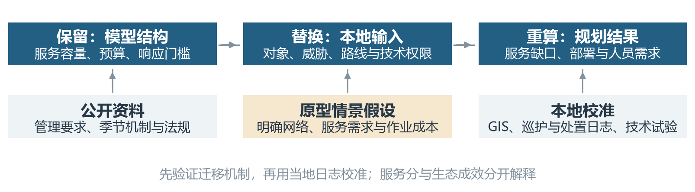
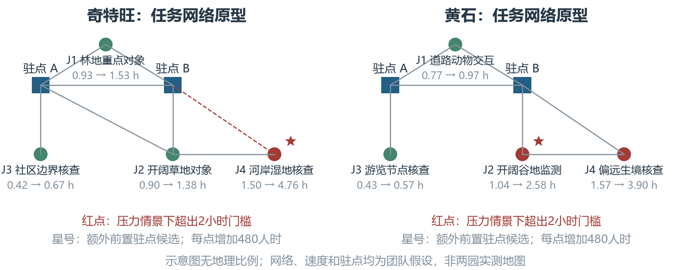
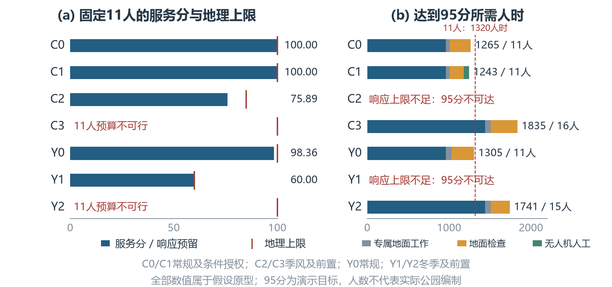

# 6 保护资源配置模型的跨大陆适配

第二、三题将地理可达性、监测能力与人力预算连接起来。将该方法用于其他保护区时，需要保留这些计算关系，并重新定义当地的保护对象、服务任务和可行条件。本文选择亚洲尼泊尔的奇特旺国家公园与北美洲美国的黄石国家公园，分别考察森林与季风通行、游客活动与冬季交通如何改变部署建议。分析分为资料支持的适配方案和可复算的任务原型；原型用于验证模型行为，其人员数不代表两园实际编制。

## 模型结构与迁移方法

### 共同结构与本地参数

保留的核心结构是“保护需求—监测服务—地面响应—资源预算—人员反求”。对保护区 \(p\) 的单元 \(j\) 和时期 \(t\)，沿用地面检查人时 \(x_{jt}^{(p)}\)、无人机机时 \(h_{jt}^{(p)}\) 和服务完成率 \(s_{jt}^{(p)}\)。需求权重 \(w_j^{(p)}\) 在园内归一化，服务评分仍为
\[
P_t^{(p)}=100\sum_jw_j^{(p)}s_{jt}^{(p)},\qquad
\sum_jw_j^{(p)}=1.

\]
权重需要依据当地重点物种、生境与管理任务重新建立，不能沿用埃托沙的物种组合或熵权数值。缺少物种分布时，应记录未知并保留对象约束，不能将未知数量当作零价值。相同分数只表示各园自身协议的完成程度，不能用于比较两园的真实生态状态。图6-1概括迁移过程。

图6-1 模型结构、本地输入与迁移验证的关系

### 可达性、技术与工作量的重建

先按时期与管理权限建立通行图 \(G_t^{(p)}\)。道路、步道、河流或雪地交通分别使用适用的通行方式与速度，禁止或缺少可用交通工具的边不进入对应作业图。由候选驻点到目标的最短去程时间 \(T_{jt}^{+}\)、返程时间 \(T_{jt}^{-}\) 和道路外单程步行时间 \(v_{jt}\)，计算
\[\begin{aligned}
r_{jt}&=\mathbf 1\!\left\{\delta+T_{jt}^{+}+v_{jt}\le\overline T_j\right\},
\\
a_{jt}&=n_j\left(T_{jt}^{+}+T_{jt}^{-}+2v_{jt}+\tau_j+\pi_j\right).

\end{aligned}\]
其中 \(\delta\) 为响应调度时间，\(\overline T_j\) 为任务对应的响应期限；\(n_j\)、\(\tau_j\)、\(\pi_j\) 分别是同行人数、现场检查和准备时间。响应范围由满足期限的候选驻点确定；监测成本使用同一可行驻点的完整往返线路。真实路网可能有方向差异，去返程应分别计算，不能将不同驻点的最短去程与返程拼接。游客封路信息只能提示需要核实权限，不能直接代替管理人员的通行条件。

令 \(m_{jt}\in\{0,1\}\) 表示无人机是否同时满足授权、天气、续航和任务等效性要求。当地法规或验证结果不支持其可用性时，直接设 \(h_{jt}=0\)。对于允许的单元，单次机时为 \(b_{jt}\)，配套人工与机时之比为 \(\gamma_{jt}\)。卫星资料可以帮助定位生境变化和候选异常，在没有发现率及人工核查记录前，不直接折算成替代巡护的服务容量。

将监测协议需求记为 \(C_{jt}\)，必须地面执行且未计入监测协议的工作记为 \(L_t\)。后者可包含社区沟通、游客现场管理或生境维护，但同一任务不能在 \(C_{jt}\) 和 \(L_t\) 重复计入。迁移后的共同约束为
\[
\begin{aligned}
C_{jt}s_{jt}&\le \frac{x_{jt}}{a_{jt}}+\frac{h_{jt}}{b_{jt}},\\
0\le s_{jt}&\le r_{jt},\qquad h_{jt}=0\quad\text{若 }m_{jt}=0,\\
x_{jt},h_{jt}&\ge0,\\
\sum_jh_{jt}&\le U_t,\\
H_t&=H_{0t}+L_t+\sum_j\left(x_{jt}+\gamma_{jt}h_{jt}\right)\le H_t^{\max}.
\end{aligned}

\]
其中 \(H_{0t}\) 是共享响应预留人时。固定资源时最大化式（6-1）；固定服务目标 \(\eta_p\) 时，最小化 \(H_t\)，另要求 \(P_t^{(p)}\ge\eta_p\)。区域底线继续按第二题的逻辑保留。当前原型每类任务各设一个代表单元，采用 \(s_{jt}\ge0.15r_{jt}\)；真实迁移应恢复区域加权底线并校准重点对象要求。

## 两类保护区的适配方案

### 奇特旺：重点物种、森林与季风通行

UNESCO资料确认奇特旺的重要保护对象包括独角犀牛和孟加拉虎，生境涉及娑罗双树林、河流与洪泛平原；2025年决定仍要求持续反偷猎，并查明犀牛死亡原因（[UNESCO](https://whc.unesco.org/en/list/284)、[2025决定](https://whc.unesco.org/en/decisions/8736/)）。因此可将重点对象监测、社区边界异常核查、草地和湿地维护分别设为任务，使用当地物种调查与事件记录重建需求。社区边界是协作和事件报告的接口，不应将社区位置直接视为偷猎风险证据。

2013—2017年管理计划记载，季风洪水和植被生长会限制车辆巡护，并安排特殊巡护和营地行动（[历史管理计划](https://faolex.fao.org/docs/pdf/nep220147.pdf)）。这支持按季节改变通行图与部署方式，但不提供本轮使用的速度折减或额外人时。森林中的识别能力需要按植被、目标和传感器校准；对林下对象与现场处置任务，不能默认无人机具有与开阔地相同的替代能力。本文基准采用地面作业，另以“取得授权且开阔草地检查等效”为条件设置无人机情景。

预期部署将更多地依赖林地地面核查、社区协作和季风前的响应准备。河岸任务若因路线改变超过响应期限，需要先考虑适用交通方式或前置驻点，再增加人员；无人机发现异常本身不能消除地面响应缺口。埃托沙人工水点的运维清单不随模型自动迁入，应由奇特旺实际生境维护台账确定新增地面任务。

### 黄石：游客交互、季节交通与技术权限

NPS的游客管理资料指出，游客活动主要集中在道路与已开发区域；影响和管理压力应按具体地点监测，而不能由游客数量直接推导全园生态恶化（[NPS游客管理](https://www.nps.gov/yell/learn/management/visitor-use.htm)）。因此可将道路沿线动物交互、热门游览节点、开阔谷地与偏远生境分别建模。野生动物监测、游客管理和执法的资格要求也需要区分，不能默认所有工作人员可以互相替代。

黄石规则规定，无人机在园内起降或操作原则上禁止，园长书面批准可例外（[NPS规则](https://www.nps.gov/yell/learn/management/lawsandpolicies.htm)）。本文未取得当地作业授权，故黄石所有原型情景均采用 \(U_t=0\)。固定自动监测装置也须核实管理权限与维护需求，不能因无人机受限就自动设为可用。冬季道路通常限制普通车辆，并存在有限雪地交通（[NPS通行条件](https://www.nps.gov/yell/planyourvisit/conditions.htm)）；迁移模型需要按管理通行权限、雪地装备和作业日志重新计算路线，本文仅用明确假设的通行压力演示其作用。

预期人工将更多地配置在游客与动物交互节点，并为冬季偏远任务配套适用交通和响应位置。生态结果应另以野生动物伤害、食物吸引问题、重要生境状态及有害火影响验证，不能将巡查完成率解释为动物损失概率。表6-1给出两园的校准接口。

表6-1 本地输入的替换内容与校准资料

| 输入 | 奇特旺所需资料 | 黄石所需资料 |
| --- | --- | --- |
| 对象与威胁 | 物种调查、栖息地分布、违法与冲突事件 | 物种与生境监测、游客交互事件、火管理记录 |
| 通行与进入 | 管理道路、河道、季风中断、驻点与社区接口 | 道路和步道、管理权限、雪地交通、季节驻点 |
| 服务与成本 | 巡护GPS、现场耗时、地面维护及响应日志 | 分地点访客量、现场核查、响应与岗位任务日志 |
| 技术与人员 | 授权、植被分层发现率、操作与核查工时 | 作业授权、传感器效果、装备与技能台账 |

## 原型验证与部署变化

为检验上述修改是否真正进入计算，每园设置四类代表任务、两个候选响应驻点，并用小型无向网络构造常规与通行压力条件。图6-2为抽象任务网络，**不是实际道路地图**。网络长度、速度、需求次数、权重、额外工作量及驻点均为团队情景假设；公开资料只支持任务类型、季节机制和权限条件。原型用于结构验证，尚未完成当地GIS路由和运行参数校准。

图6-2 两园任务网络及通行压力下的响应时间变化；全部网络参数为情景假设

两园分别在自己的任务集合中使用冻结的权重和检查量，比较固定11人及固定95分目标两种问题。95分是演示用的协议完成目标，未被解释为生态安全阈值；单人有效工时固定120小时。两处驻点各预留两人、每日8小时、标准月30天响应，共
\[
H_0=2\times2\times8\times30=960\ \text{人时/月},\qquad
N_t=\left\lceil\frac{H_t^{\min}}{120}\right\rceil.

\]
增加一个前置驻点另计480人时。为保持通行影响的可比性，压力情景不重新归一化权重，也不删除不可响应任务。奇特旺额外专属地面工作由48增至72人时/月；黄石保持72人时/月，用于隔离通行条件的影响。后者是控制情景，未模拟真实冬季游客工作量变化。

表6-2 四类代表任务的假设权重与月度检查需求

| 保护区 | 单元 | 代表任务 | 权重 | 检查点次/月 |
| --- | --- | --- | --- | --- |
| 奇特旺 | J1 | 林地重点对象 | 0.30 | 24 |
|  | J2 | 开阔草地对象 | 0.30 | 24 |
|  | J3 | 社区边界核查 | 0.25 | 20 |
|  | J4 | 河岸湿地核查 | 0.15 | 12 |
| 黄石 | J1 | 道路动物交互 | 0.35 | 30 |
|  | J2 | 开阔谷地监测 | 0.25 | 24 |
|  | J3 | 游览节点核查 | 0.25 | 16 |
|  | J4 | 偏远生境核查 | 0.15 | 10 |

式（6-2）给出与资源预算独立的响应范围上限：
\[
P_t^{\mathrm{geo}}=100\sum_jw_jr_{jt}.

\]
当 \(\eta_p>P_t^{\mathrm{geo}}\) 时，在既定驻点和交通条件下，增加总工时仍不能达到目标。表6-3与图6-3分别报告可行性和人时构成。“预算不可行”表示固定11人不足以承担响应预留与必要工作，不能写成服务分为零；“目标不可达”表示95分超过该情景的地理上限。

表6-3 条件性迁移原型结果；全部人数仅对应原型任务集合

| 情景 | 设置 | 上限 | 11人服务分 | 95分人时 | 人数 |
| --- | --- | --- | --- | --- | --- |
| C0 | 非季风、地面 | 100 | 100.00 | 1265.01 | 11 |
| C1 | 条件授权无人机 | 100 | 100.00 | 1243.41 | 11 |
| C2 | 季风通行压力 | 85 | 75.89 | 目标不可达 | -- |
| C3 | 季风＋前置驻点 | 100 | 预算不可行 | 1834.56 | 16 |
| Y0 | 常规道路 | 100 | 98.36 | 1304.84 | 11 |
| Y1 | 冬季通行压力 | 60 | 60.00 | 目标不可达 | -- |
| Y2 | 冬季＋前置驻点 | 100 | 预算不可行 | 1740.58 | 15 |

奇特旺常规原型达到95分需要1265.01人时。条件授权情景只允许开阔草地J2使用无人机，以16机时为上限，实际使用7.20机时；配套移动和操作人工仍计入预算。所需人时降至1243.41，节省21.60人时，但两种方案均向上取整为11人。因此整数人数不变并不表示技术没有作用，节省量也不能外推到林下监测或执法。季风压力下，J4响应时间由1.50增至4.76小时，地理上限降至85分；固定11人只能获得75.89分。新增J4前置驻点恢复原型可达性，但计入新增响应值守后，需要1834.56人时，即16人。

黄石常规原型固定11人得到98.36分，维持95分需要1304.84人时。冬季压力下，J2与J4分别超过两小时门槛，地理上限降至60分；此时增加巡查总人时不能恢复95分。新增J2前置驻点后，原型中J4可通过所设雪地通行连接响应，维持目标需要1740.58人时，即15人。此建议以相应交通、作业资格和驻点条件可用为前提，不是由公众封路规则直接推导出的实地部署。

图6-3 固定人员与固定目标的迁移结果；C1无人机可用性为条件假设

七个情景均完成初步数值核验：以Floyd--Warshall独立复核Dijkstra路线，以分数背包计算复核线性规划的最优评分和最少人时，并检查服务容量、技术禁用、预算、人数取整及新增驻点响应人时。将预算提高至100000人时后，两个响应范围不足情景仍不能达到95分，确认模型保留了地理约束。该验证证明原型的计算关系一致，尚不证明两园现实部署或生态成效。

由此，迁移后的指标与部署变化应按原因解释：任务和权重改变会改变服务分的含义；技术适用性改变会影响监测人工；季节交通改变会影响响应上限；新增驻点则同时改变可达范围与固定人力。实际应用时，应先用表6-1所列当地资料替换原型参数，再分期求解，保留不可响应与资料未知对象，并用运行日志和生态结果继续验证。

复现与证据见[第六题计算说明](../modeling_notes/question6_calculation_notes.md)。
