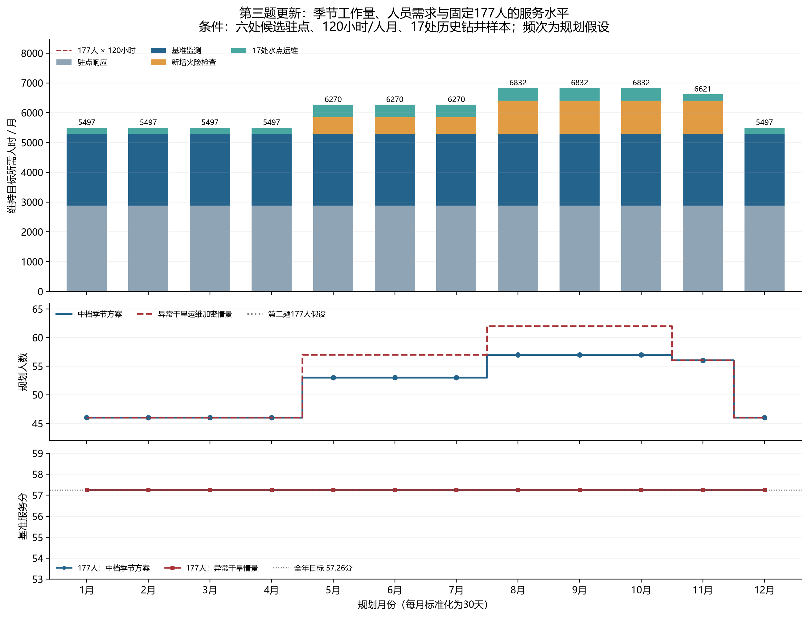
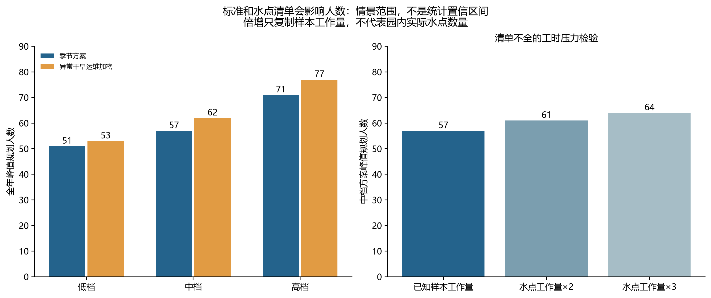
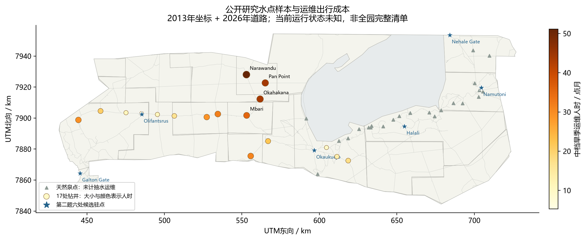

# 第三题：模型实算与待校准参数

2026-10-05，讨论用初算；模型、数据、核验和图表已完成，尚未扩写正式论文。

**当前结论：中档季节方案全年需57名保护岗位人员；若旱季出现所设的异常干旱运维压力，需62人。** 人数针对第二题的监测/日间响应任务及17处历史钻井水点样本，不是公园全体工作人员的真实最低编制。第二题假设的177名保护人员足以完成中档季节工作。

## 数据与假设怎么分

|内容|取得的依据|本次用法|
|---|---|---|
|旱季5—10月、湿季11—4月|[2024年研究数据说明](https://datadryad.org/dataset/doi:10.5061/dryad.4qrfj6qm3)，研究范围主要在东北部|采用季节划分；不声称2026年已发生异常干旱|
|早旱季5—7月、重点火管理8—11月|[官方2016年火管理策略](https://www.meft.gov.na/files/downloads/66c_Fire%20Management_Strategy%20Final%20Version.pdf)，Etosha章节PDF第33、40页|决定加密检查的时间窗口；不从历史过火比例推算工作人员|
|水点坐标与类型|[Koedoe原研究Table1](https://koedoe.co.za/index.php/koedoe/article/view/1329/1890)，2013年5月现场调查|42条记录，其中17条BH钻井全部可沿模型路网到达；A/C天然泉不计抽水设备运维，缺坐标和缺类别保留未知|
|人工水点工作方式|[MEFT 2021/2022年报](https://www.meft.gov.na/files/downloads/MEFT%20Annual%20Report%202021-2022.pdf)，PDF第28页有太阳能改造记录|把补水保障表示为到场检查抽水系统、清理和小修；不虚构运水车载量或供水体积|
|道路、成本、机队、评分权重|第二题保存的599点模型|直接复用；17个父区用于汇总，不再按区域中心代替小单元|

OSM另抽取287个候选水面/水井要素，仅7个明确标为water_well，且存在邻近重复、用途和运行状态未知。不能把287或7当人工动物水点总数。当前采用有原研究类型证据的17处样本，完整点位台账仍是正式写作前最需要补充的数据。原图、下载文件、链接和SHA-256已保存在[data/question3](../data/question3/raw/source_manifest.json)。

## 模型：保持基准服务，加上两项明确工作

目标使用第二题同一条件下的最优服务分：

\[
\eta=P_2^*=57.26016128,\qquad P_t=100\sum_jw_js_{jt}\ge\eta.
\]

它表示保持第二题已实现的服务水平，客观地来自已有优化结果；**它不能证明第二题的服务标准已足以产生某种生态成效。** 原每100km²每月8点次、2小时响应、每区可达部分15%底线等仍是第二题的规划假设。

|决策量|容易理解的含义|单位|
|---|---|---|
|$x_{jt},h_{jt}$|用于原有合格监测的地面人工、无人机飞行|人时、机时|
|$s_{jt}$|第$j$个检查单元的基准检查完成比例|0至可达上限$r_j$|
|$y_{jt},v_{jt}$|用于额外火险检查的地面人工、无人机飞行|人时、机时|
|$N_t$|先求最少总人时，再向上取整得到人数；不是LP直接决策|人|

水点必须到场工作，所以其人时预先按路线算好，不可用无人机替代。单人有效工时固定120小时，各月统一按30天规划；未另扣节假日等因素。

令第二题的$a_j,b_j,o_j$分别为一次完整检查的地面人时、飞行机时和无人机配套人时，$\gamma_j=o_j/b_j$。$C_j$为原规定检查数；额外火险检查数为

\[
D_{jt}=k_t\frac{A_j^{fuel}}{100}r_j.
\]

$A_j^{fuel}$由区域可燃生境比例乘检查单元真实面积计算。中档$k_t$：常规月0、5—7月2、8—11月4，单位为每100km²可燃生境每月额外点次。增加的是独立火险筛查任务，保持与第二题相同的观察协议和成本；不把同一次检查算两次，也未加入扑救和计划燃烧人时。

每月逆向LP：

\[
\min H_t=H_0+W_t+\sum_j(x_{jt}+\gamma_jh_{jt}+y_{jt}+\gamma_jv_{jt}),
\]

\[
\frac{x_{jt}}{a_j}+\frac{h_{jt}}{b_j}\ge C_js_{jt},\quad
\frac{y_{jt}}{a_j}+\frac{v_{jt}}{b_j}\ge D_{jt},\quad
\sum_j(h_{jt}+v_{jt})\le1200.
\]

同时保留$0\le s_{jt}\le r_j$、原区域底线和无人机适用条件。$H_0=2880$人时每月，只预留一次。逆向求解移除21240人时上限；固定资源分析则加入$H_t\le177\times120$并最大化同一$P_t$。全年人数为$\max_t\lceil H_t/120\rceil$。

固定驻点可响应的可燃生境约6894.1km²，占模型可燃生境39.2%。峰值新增任务可履行275.76点次，另428.45点次位于原响应不可达范围，单独记录未保障；**增加人员不能修复这个地理缺口，本次不称全园火管理已全部达标。**

## 增加次数和人时是怎么来的

次数不是资料给定的官方定额，而是可核对的规划规则。中档以等间隔运维为安排原则，把湿季水点检查目标间隔设为15天，旱季7.5天，因此标准30天月分别安排2、4次；异常干旱压力下设3.75天，即8次。LP核验月度工作量，尚未安排实际日期，不能证明每次间隔均满足。现场时间平时0.5小时、压力下1小时，均为假设，不是测得的故障率。

每处水点$\ell$的一次作业人时：

\[
a_\ell^W=2\left(T_\ell^{round}+\tau_t+\frac1{12}\right),\qquad W_t=\sum_\ell f_ta_\ell^W.
\]

两人同行，$T^{round}$是六处候选驻点中往返最快方案的路网行车及道路外步行时间，保留单行限制。17处合计往返经过42.87565小时；没有2小时维护到场限制，因为这是预先安排的运维。

中档旱季水点人时为$4\times2[42.87565+17(0.5+1/12)]=422.34$；湿季211.17；异常干旱980.68。火险额外2、4点次对应561.69、1123.38人时，由LP根据逐点成本选择地面或无人机，不能将火风险比例直接乘总人数。独立出行没有合并路线抵扣，可能偏高；大修、地下水位下降和实际缺水体积尚未建模。

## 求解结果与图表

|时期|需要人时/月|需要人数|使用机时/月|固定177人服务分|
|---|---:|---:|---:|---:|
|1—4月、12月|5497.3|46|144.3|57.26|
|5—7月|6270.1|53|177.5|57.26|
|8—10月|6831.8|57|210.6|57.26|
|11月|6620.7|56|210.6|57.26|

8—10月：$2880+2406.11+1123.38+422.34=6831.83$人时，除以120向上取整为57人。全年固定57人可维持同一目标；56人在峰值月只能得到56.73分。177人是第二题的295×60%假设保护岗位数，不能解释为实际已有177名巡护人员，也不据此建议现实裁员。

异常干旱运维加密时，峰值7390.17人时，即62人；固定177人峰值服务57.26分，仍达到目标。相对常规57人的月度容量需求增加5人，但177人的参考配置无需追加。



|假设服务强度|季节方案峰值人数|异常干旱压力下|
|---|---:|---:|
|低档|51|53|
|中档|57|62|
|高档|71|77|

低/中/高档水点湿季频次1/2/4、旱季2/4/8，火险早期1/2/4、晚期2/4/8；完整参数见[q3_assumptions.json](../data/modeling/q3_assumptions.json)。它们不是置信区间，说明选择不同服务标准会得到不同人数。若按相同样本平均成本复制水点工作量2、3倍，中档峰值为61、64人；这只是清单缺失压力检验，不能当真实水点数量或空间外推。





## 核验及本轮微调

- 36个月份/求解模式组合均通过逐点容量、火险额外任务、区域底线、机时、人时、评分和取整核验；低中高情景另查。独立脚本直接读取保存的Q2输入与Q3解，核对新增需求、全部保存的可行解、分区CSV和指纹。比地理上限高的目标正确拒绝，响应预算不足正确无解。
- 修订后的第二题第二阶段保留最优总分，允许全部服务比例和投入重新选择。第三题无新增工作时的独立逆向LP同样得到5286.11人时；两题均为同一最优总分下的全局最少人工。原固定服务向量方案5379.02人时只保留历史备查，不能再当作当前保存解。
- 可燃生境需求统一为“面积×同口径比例”，避免混用投影后的面积分母；极小权重做数值缩放。达到地理上限时固定所有正权重可达点完成率为1，这是原评分约束的等价处理。
- 新水点路由补入同一条道路上的直接通行，避免不必要地绕行道路端点；Q2成本与结果原样保留。
- 30架是设备库存，不要求30组同时出动；每次无人机任务的两人配套人工已计入成本。最长中档水点出行及作业6.39小时，月度连续LP仍不能证明详细排班、整数派遣或每驻点并发任务可行。

正式写作前优先校准：当前完整人工水点清单及岗位归属、到场频次与耗时、季节火险筛查定额。当前结果足以讨论模型结构和参数方向；没有真实作业日志，不给人数精确到个位的现实承诺。

复算命令（项目根目录，conda环境himcn-roads）：

```powershell
python -B scripts/modeling/prepare_question3.py
python -B scripts/modeling/build_question3.py
python -B scripts/modeling/write_question3_report.py
python -B scripts/modeling/verify_question3.py
```

结果：[月表](../output/question3/q3_monthly.csv)、[完整解](../output/question3/q3_results.json)、[核验](../output/question3/q3_verification.json)、[独立核验](../output/question3/q3_independent_verification.json)、[每点水运维](../output/question3/q3_water_visits_base.csv)。没有提交或推送。
